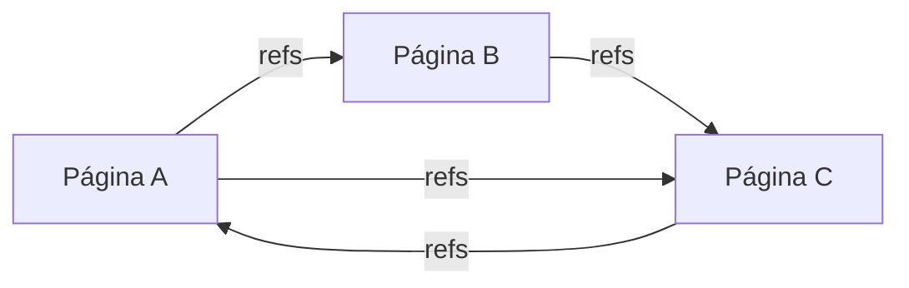

# Vista Grafo — Resumen Ejecutivo

## Overview

La **Vista Grafo** es una visualización del conocimiento que muestra páginas y bloques como nodos conectados por referencias (backlinks). Es similar a la vista de grafo de Logseq, permitiendo navegar el conocimiento de forma visual.



## Estado Actual

| Componente | Estado | Notas |
|------------|--------|-------|
| Entidades Page/Block | ✅ Listo | `Block.refs: Vec<Uuid>` disponible |
| LightweightGraph | ✅ Listo | En `cognitive_mirror/graph.rs` |
| resource_graph MCP | ⚠️ Incompleto | Solo devuelve recuentos, no el grafo real |
| Vista ArgumentMap | ✅ Referencia | Patrón existente en `argument_map.rs` |
| Puente Tauri | ✅ Listo | `invoke()` en `bridge.rs` |

## Lo que Ya Existe

### Datos (Block.refs)
```rust
// crates/quilt-domain/src/entities/block.rs
pub struct Block {
    pub refs: Vec<Uuid>,  // ← Esto es lo que我们需要 para los edges
    // ...
}
```

### Grafo Liviano
```rust
// crates/quilt-cognitive/src/cognitive_mirror/graph.rs
pub struct LightweightGraph {
    adj: HashMap<Uuid, Vec<Uuid>>,      // outgoing edges
    incoming: HashMap<Uuid, Vec<Uuid>>, // incoming edges (backlinks)
    nodes: HashSet<Uuid>,
}
```

## Lo que Falta

1. **Extender resource_graph** para devolver la estructura real del grafo (nodos + aristas)
2. **Nuevo endpoint MCP** o comando Tauri para obtener datos del grafo
3. **Componente Leptos** para renderizar la visualización
4. **Layout algorithm** (force-directed, dagre, etc.)
5. **Interacciones UI** (zoom, pan, click-to-navigate)

## Arquitectura Propuesta

```
┌─────────────┐     ┌──────────────┐     ┌─────────────┐
│  SQLite DB  │────▶│ Tauri Command│────▶│ Leptos WASM │
│  Block.refs │     │ (resource_   │     │ GraphView   │
└─────────────┘     │ graph)       │     └─────────────┘
                    └──────────────┘            │
                                                ▼
                                         ┌─────────────┐
                                         │ SVG/Canvas  │
                                         │ (d3-force)  │
                                         └─────────────┘
```

## Complexity Estimate

| Aspecto | Complejidad | Estimación |
|---------|-------------|------------|
| Backend (extender MCP) | Baja | 1-2 días |
| Puente Tauri → Leptos | Baja | Ya existe patrón |
| Layout Algorithm | Media | 2-3 días (d3-force WASM) |
| UI Componente | Media | 2-3 días |
| Interacciones | Media | 1-2 días |
| **Total** | — | **~8-12 días** |

## Recomendación

**Comenzar con un MVP** que:
1. Extienda `resource_graph` para devolver `{nodes: [...], edges: [...]}`
2. Use D3.js via WASM (o sigma.js) para el layout force-directed
3. Muestre todas las páginas como nodos, refs como aristas
4. Permita zoom/pan básico y click para navegar

El código existente en `cognitive_mirror/graph.rs` puede ser referencia directa para el layout algorithm.

## Archivos de la Serie

- [01-logseq-analysis.md](./01-logseq-analysis.md) — Cómo Logseq implementa su vista grafo
- [02-stack-analysis.md](./02-stack-analysis.md) — Nuestro stack actual y qué podemos reutilizar  
- [03-algorithms.md](./03-algorithms.md) — Algoritmos de layout y opciones de librerías
- [04-proposed-architecture.md](./04-proposed-architecture.md) — Cómo encaja en Quilt
