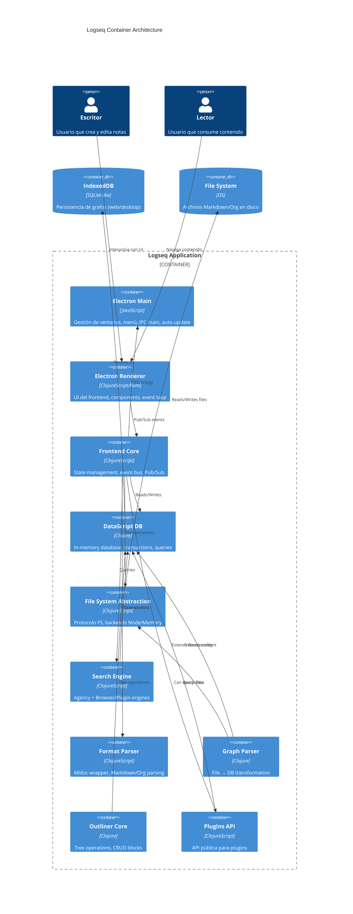

# C4 Container (C2) — Logseq

> **Escala**: 🟢 CONFIRMADO | 🟡 INFERIDO | 🔴 LACUNA
> **Nivel**: Containers (Aplicación descompuesta en contenedores de despliegue)
> **Fecha**: 2026-05-02

---

## Diagrama de Containers



---

## Contenedores

### 1. Electron Main 🟢

| Aspecto | Detalle |
|---------|---------|
| **Tecnología** | JavaScript (Node.js) |
| **Ubicación** | `static/electron.js`, `src/electron/` |
| **Responsabilidad** | Window management, menus, IPC main, auto-update, CLI launcher |
| **Puerto de entrada** | `main` function en `electron.js` |

**Funciones principales**:
- `create-main-window!` → BrowserWindow
- `setup-window-listeners!` → cleanup-fn
- `set-ipc-handler!` → IPC handlers registration
- `setup-interceptor!` → Custom protocols (lsp://, assets://)

**Se comunica con**: Electron Renderer (via IPC)

---

### 2. Electron Renderer 🟢

| Aspecto | Detalle |
|---------|---------|
| **Tecnología** | ClojureScript + Rum (React fork) |
| **Ubicación** | `src/main/frontend/components/` |
| **Responsabilidad** | UI components, user interaction handling |
| **Entry point** | `frontend/core.cljs`, `state.cljs` |

**Componentes principales**:
- `container.cljs` — Root component
- `editor.cljs` — Block editor
- `block.cljs` — Block renderer
- `page.cljs` — Page renderer
- `journal.cljs` — Journal view
- `query.cljs` — Query component
- `left_sidebar.cljs` / `right_sidebar.cljs` — Navigation
- `settings.cljs` — Configuration UI

**Se comunica con**: Frontend Core (events), Electron Main (IPC)

---

### 3. Frontend Core 🟢

| Aspecto | Detalle |
|---------|---------|
| **Tecnología** | ClojureScript |
| **Ubicación** | `src/main/frontend/state.cljs`, `handler/events.cljs` |
| **Responsabilidad** | Global state, event bus, pub/sub, event loop |
| **Entry point** | `state.cljs` (atoms), `handler/events.cljs` (async loop) |

**State atoms principales**:
```clojure
{:route-match      ; Current route
 :db/restoring?    ; DB restore in progress
 :editor/editing?  ; Editor state
 :ui/sidebar       ; Sidebar visibility
}
```

**Event system**:
- `state/pub-event!` → Publish event to channel
- `handler/run!` → Starts core.async go-loop
- `handle` (multimethod) → Dispatches by event type

**Se comunica con**: DataScript DB, FS Protocol, Search Engine, Format Parser, Plugins API

---

### 4. DataScript DB 🟢

| Aspecto | Detalle |
|---------|---------|
| **Tecnología** | Clojure + DataScript (fork) |
| **Ubicación** | `src/main/frontend/db/`, `deps/db/` |
| **Responsabilidad** | In-memory database, Datalog queries, transactions |
| **Schema** | Block (18 campos), Page (11 campos), File (6 campos) |

**Archivos clave**:
- `conn.cljs` — Connection management
- `transact.cljs` — Async transactions
- `query_dsl.cljs` — DSL parser → Datalog
- `query_react.cljs` — Reactive queries for UI
- `react.cljs` — Query result caching
- `model.cljs` — Domain model functions

**Se comunica con**: IndexedDB (persistence), Outliner Core (tree ops)

---

### 5. File System Abstraction 🟢

| Aspecto | Detalle |
|---------|---------|
| **Tecnología** | ClojureScript |
| **Ubicación** | `src/main/frontend/fs/` |
| **Responsabilidad** | Platform-agnostic file operations |

**Protocolo** (`frontend.fs.protocol`):
```clojure
(defprotocol Fs
  (mkdir! [this dir])
  (mkdir-recur! [this dir])
  (readdir [this dir])
  (unlink! [this repo path opts])
  (read-file [this dir path opts])
  (write-file! [this repo dir path content opts])
  (stat [this path])
  (watch-dir! [this dir options])
)
```

**Implementaciones**:
- `node.cljs` — Node.js (Electron desktop)
- `memory_fs.cljs` — In-memory (testing/web)

**Se comunica con**: File System (OS), Graph Parser

---

### 6. Search Engine 🟢

| Aspecto | Detalle |
|---------|---------|
| **Tecnología** | ClojureScript |
| **Ubicación** | `src/main/frontend/search/` |
| **Responsabilidad** | Full-text search across blocks and pages |

**Architecture (Agency pattern)**:
- `agency.cljs` — Coordinates multiple engines
- `browser.cljs` — Native browser implementation
- `plugin.cljs` — Plugin-provided engines

**Protocolo**:
```clojure
(defprotocol Engine
  (query [_this q opts])
  (rebuild-blocks-indice! [_this])
  (transact-blocks! [_this data])
)
```

**Se comunica con**: DataScript DB (reads data)

---

### 7. Format Parser 🟢

| Aspecto | Detalle |
|---------|---------|
| **Tecnología** | ClojureScript |
| **Ubicación** | `src/main/frontend/format/` |
| **Responsabilidad** | Parse Markdown/Org content to AST |

**Protocolo**:
```clojure
(defprotocol Format
  (toEdn [_this content config])
  (toHtml [_this content config references])
  (exportMarkdown [_this content config references])
)
```

**Formatos soportados**:
- `:markdown` / `:md`
- `:org` (Org-mode)

**Se comunica con**: Graph Parser (provides AST)

---

### 8. Graph Parser 🟢

| Aspecto | Detalle |
|---------|---------|
| **Tecnología** | Clojure |
| **Ubicación** | `deps/graph-parser/` |
| **Responsabilidad** | Transform files → DataScript entities |

**Pipeline**:
```
File → Detect format → Mldoc → AST → Extract pages/blocks → DataScript
```

**Funciones principales**:
- `extract` — Full extraction (pages, blocks, ast)
- `extract-pages-and-blocks` — Core parsing
- `title-parsing` — Page name from file/properties
- `build-page-map` — Page entity construction

**Se comunica con**: File System (reads files), DataScript DB (writes)

---

### 9. Outliner Core 🟢

| Aspecto | Detalle |
|---------|---------|
| **Tecnología** | Clojure |
| **Ubicación** | `deps/outliner/` |
| **Responsabilidad** | Tree-structured block operations |

**Protocolo**:
```clojure
(defprotocol INode
  (-save [this *txs-state conn opts])
  (-del [this *txs-state db]))
```

**Operaciones**:
- `:save-block` — Persist block changes
- `:insert-blocks` — Insert new blocks
- `:delete-blocks` — Remove blocks
- `:move-blocks` — Move within/across pages
- `:indent-outdent-blocks` — Change nesting level

**Se comunica con**: DataScript DB (transactions)

---

### 10. Plugins API 🟢

| Aspecto | Detalle |
|---------|---------|
| **Tecnología** | ClojureScript |
| **Ubicación** | `src/main/logseq/`, `src/main/frontend/extensions/` |
| **Responsabilidad** | Public API for third-party plugins |

**Capabilities**:
- `logseq.DB` — Query data
- `logseq.Editor` — Manipulate editor
- `logseq.App` — UI state
- `logseq.Search` — Search provider

**Se comunica con**: DataScript DB (read-only queries), Frontend Core (events)

---

## Tecnologías por Container

| Container | Lenguaje | Framework | Confianza |
|-----------|----------|-----------|-----------|
| Electron Main | JavaScript | Electron | 🟢 |
| Electron Renderer | ClojureScript | Rum (React fork) | 🟢 |
| Frontend Core | ClojureScript | core.async | 🟢 |
| DataScript DB | Clojure | DataScript | 🟢 |
| File System | ClojureScript | Protocol pattern | 🟢 |
| Search Engine | ClojureScript | Agency pattern | 🟢 |
| Format Parser | ClojureScript | Mldoc | 🟢 |
| Graph Parser | Clojure | Mldoc | 🟢 |
| Outliner Core | Clojure | DataScript | 🟢 |
| Plugins API | ClojureScript | - | 🟢 |

---

## Flujo de datos principal

### Flujo 1: Crear nota

```
User → Editor component → state/pub-event! [:editor/save-block]
    → events channel → handle (multimethod)
    → outliner/save-block → transact → DataScript
    → fs/write-file! → File System
    → graph/index → DataScript (search index)
```

### Flujo 2: Query

```
User → Query component → frontend.db/query_dsl/parse
    → DataScript Datalog query
    → Query result → React component re-render
```

### Flujo 3: File import

```
File System → Graph Parser/extract
    → [pages blocks ast]
    → DataScript transact
    → Search engine rebuild
```

---

*Generado por Reversa Architect - 2026-05-02*
