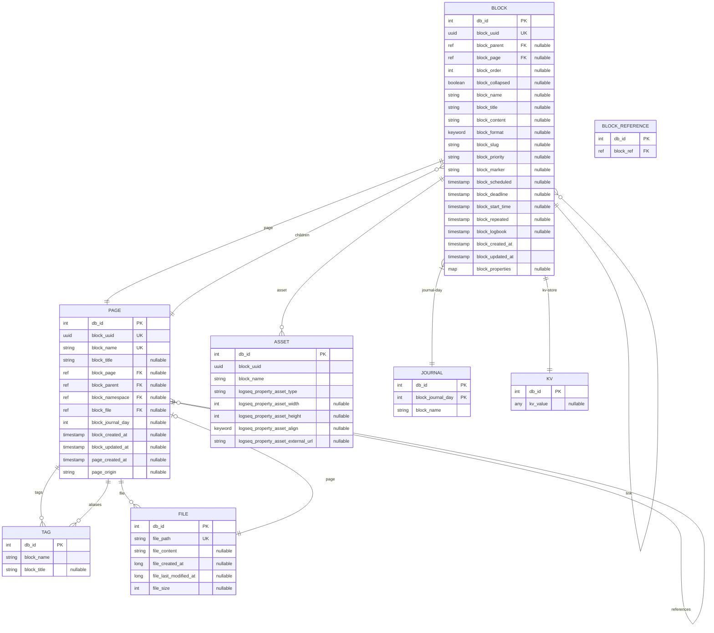

# ERD Completo — Logseq

> **Escala**: 🟢 CONFIRMADO | 🟡 INFERIDO | 🔴 LACUNA
> **Fecha**: 2026-05-02
> **Fuente**: `deps/db/src/logseq/db/frontend/schema.cljs`

---

## Diagrama ERD



---

## Entidades

### 1. BLOCK 🟢

Entidad principal del sistema. Representa una unidad de contenido dentro de Logseq.

| Campo | Tipo | Requerido | Único | Índice | Descripción |
|-------|------|-----------|-------|--------|-------------|
| `db/id` | int | ✅ | ✅ | ✅ | Identificador interno DataScript |
| `block/uuid` | uuid | ✅ | identity | ✅ | UUID público del bloque |
| `block/parent` | ref | ❌ | - | ✅ | Referencia al bloque padre |
| `block/page` | ref | ❌ | - | ✅ | Referencia a la página madre |
| `block/order` | int | ❌ | - | ✅ | Orden entre siblings |
| `block/collapsed?` | boolean | ❌ | - | - | Si está colapsado en outliner |
| `block/name` | string | ❌ | - | ✅ | Nombre para bloques especiales |
| `block/title` | string | ❌ | - | ✅ | Título del bloque |
| `block/content` | string | ❌ | - | - | Contenido en formato nativo |
| `block/format` | keyword | ❌ | - | - | `:markdown` o `:org` |
| `block/slug` | string | ❌ | - | - | Slug URL-friendly |
| `block/priority` | string | ❌ | - | - | `A`, `B`, `C` |
| `block/marker` | string | ❌ | - | - | `todo`, `doing`, `done`, `later`, `now` |
| `block/scheduled` | timestamp | ❌ | - | ✅ | Fecha de scheduled |
| `block/deadline` | timestamp | ❌ | - | ✅ | Fecha de deadline |
| `block/start-time` | timestamp | ❌ | - | - | Start time para duración |
| `block/repeated` | timestamp | ❌ | - | - | Para tareas recurrentes |
| `block/logbook` | timestamp | ❌ | - | - | Estado logbook (CLOSED) |
| `block/refs` | [ref] | ❌ | - | ✅ | Referencias a otros bloques/páginas |
| `block/tags` | [ref] | ❌ | - | ✅ | Tags/clases del bloque |
| `block/link` | ref | ❌ | - | ✅ | Link externo |
| `block/alias` | [ref] | ❌ | - | ✅ | Alias del bloque |
| `block/journal-day` | int | ❌ | - | ✅ | Día de journal (YYYYMMDD) |
| `block/tx-id` | int | ❌ | - | - | ID de transacción |
| `block/created-at` | long | ❌ | - | ✅ | Timestamp de creación |
| `block/updated-at` | long | ❌ | - | ✅ | Timestamp de actualización |
| `block/closed-value-property` | [ref] | ❌ | - | - | Para propiedades de tipo closed |
| `block/properties` | map | ❌ | - | - | Propiedades custom (key/value) |

**Constraints**:
- `block/uuid` tiene `unique: identity`
- No se puede mover un bloque a sus propios descendientes (validación circular)

---

### 2. PAGE 🟢

Representa una página en Logseq. Las páginas pueden ser regulares o journals.

| Campo | Tipo | Requerido | Único | Índice | Descripción |
|-------|------|-----------|-------|--------|-------------|
| `db/id` | int | ✅ | ✅ | ✅ | Identificador interno |
| `db/ident` | keyword | ❌ | ✅ | - | Identificador único global |
| `block/uuid` | uuid | ✅ | identity | ✅ | UUID público |
| `block/name` | string | ✅ | - | ✅ | Nombre único de página |
| `block/title` | string | ❌ | - | ✅ | Título alternativo |
| `block/page` | ref | ❌ | - | - | Auto-referencia (página como bloque) |
| `block/parent` | ref | ❌ | - | - | Referencia a página padre (namespaces) |
| `block/alias` | [ref] | ❌ | - | ✅ | Alias (otras páginas con mismo contenido) |
| `block/tags` | [ref] | ❌ | - | ✅ | Tags/clases |
| `block/journal-day` | int | ❌ | - | ✅ | Si es journal (YYYYMMDD) |
| `block/namespace` | ref | ❌ | - | ✅ | Namespace de la página (parent) |
| `block/file` | ref | ❌ | - | ✅ | Archivo de origen |
| `block/created-at` | long | ❌ | - | ✅ | Timestamp creación |
| `block/updated-at` | long | ❌ | - | ✅ | Timestamp actualización |
| `page/original-name` | string | ❌ | - | - | Nombre original antes de rename |
| `page/journal?` | boolean | ❌ | - | - | Si es página de journal |
| `page/created-at` | timestamp | ❌ | - | - | Fecha de creación de página |
| `page/updated-at` | timestamp | ❌ | - | - | Fecha de actualización |
| `page/origin` | string | ❌ | - | - | Origen de la página |

**Constraints**:
- `block/name` es único para páginas regulares
- Journal pages tienen `block/journal-day` set
- `db/ident` es único globalmente

---

### 3. FILE 🟢

Representa un archivo en el sistema de archivos.

| Campo | Tipo | Requerido | Único | Índice | Descripción |
|-------|------|-----------|-------|--------|-------------|
| `db/id` | int | ✅ | ✅ | ✅ | Identificador interno |
| `file/path` | string | ✅ | identity | ✅ | Ruta única del archivo |
| `file/content` | string | ❌ | - | - | Contenido completo del archivo |
| `file/created-at` | long | ❌ | - | - | Timestamp creación |
| `file/last-modified-at` | long | ❌ | - | - | Timestamp última modificación |
| `file/size` | int | ❌ | - | - | Tamaño en bytes |

**Constraints**:
- `file/path` tiene `unique: identity`

---

### 4. TAG 🟢

Representa tags/clases asignados a páginas o bloques.

| Campo | Tipo | Requerido | Único | Índice | Descripción |
|-------|------|-----------|-------|--------|-------------|
| `db/id` | int | ✅ | ✅ | ✅ | Identificador interno |
| `block/name` | string | ✅ | - | ✅ | Nombre del tag (sin #) |
| `block/title` | string | ❌ | - | ✅ | Título opcional |

---

### 5. JOURNAL 🟢

Vista especializada de PAGE para journals diarios.

| Campo | Tipo | Requerido | Único | Índice | Descripción |
|-------|------|-----------|-------|--------|-------------|
| `db/id` | int | ✅ | ✅ | ✅ | Heredado de PAGE |
| `block/journal-day` | int | ✅ | ✅ | ✅ | Día del journal (YYYYMMDD) |
| `block/name` | string | ✅ | - | ✅ | Nombre del journal |

**Derivation**: Journal es una PAGE donde `block/journal-day` no es null.

---

### 6. ASSET 🟢

Representa assets embebidos en bloques (imágenes, PDFs, audio).

| Campo | Tipo | Requerido | Único | Índice | Descripción |
|-------|------|-----------|-------|--------|-------------|
| `db/id` | int | ✅ | ✅ | ✅ | Identificador interno |
| `block/uuid` | uuid | ✅ | - | ✅ | UUID del bloque padre |
| `block/name` | string | ❌ | - | ✅ | Nombre/título del asset |
| `logseq.property.asset/type` | string | ✅ | - | - | Tipo: image, pdf, audio, video |
| `logseq.property.asset/width` | int | ❌ | - | - | Ancho (para imágenes) |
| `logseq.property.asset/height` | int | ❌ | - | - | Alto (para imágenes) |
| `logseq.property.asset/align` | keyword | ❌ | - | - | `:left`, `:center`, `:right` |
| `logseq.property.asset/external-url` | string | ❌ | - | - | URL para assets externos |

---

### 7. KV 🟢

Almacenamiento clave-valor genérico.

| Campo | Tipo | Requerido | Único | Índice | Descripción |
|-------|------|-----------|-------|--------|-------------|
| `db/id` | int | ✅ | ✅ | ✅ | Identificador |
| `kv/key` | string | ✅ | identity | ✅ | Clave |
| `kv/value` | any | ❌ | - | - | Valor arbitrario |

**Uso**: Almacenar preferencias, estados de UI, metadata.

---

## Relaciones

### Relaciones confirmadas 🟢

```yaml
BLOCK → PAGE:
  Tipo: N:1
  Campo: block/page
  Descripción: Un bloque pertenece a una página
  
BLOCK → BLOCK (parent):
  Tipo: N:1  
  Campo: block/parent
  Descripción: Un bloque tiene un padre (árbol)
  
BLOCK → BLOCK (children):
  Tipo: 1:N
  Campo: block/parent (reverse)
  Descripción: Un bloque puede tener hijos
  
PAGE → PAGE (namespace):
  Tipo: N:1 (self-ref)
  Campo: block/namespace
  Descripción: Namespaces jerárquicos
  
PAGE → TAG:
  Tipo: N:M
  Campo: block/tags
  Descripción: Tags asignados a páginas
  
PAGE → FILE:
  Tipo: N:1
  Campo: block/file
  Descripción: Una página está vinculada a un archivo
  
BLOCK → BLOCK (refs):
  Tipo: N:M (self-ref)
  Campo: block/refs
  Descripción: Referencias bidireccionales entre bloques
  
BLOCK → ASSET:
  Tipo: 1:N
  Campo: block/uuid (en asset)
  Descripción: Assets embebidos en bloque
  
PAGE → JOURNAL:
  Tipo: Inheritance
  Herencia: block/journal-day IS NOT NULL
  Descripción: Journal es un subtipo de PAGE
```

---

## Cardinalidad

```
┌─────────────────────────────────────────────────────────────────┐
│                           PAGE (1)                               │
│    ┌─────────────────────────────────────────────────────────┐  │
│    │ 1:N → BLOCK (children)                                  │  │
│    │ 1:1 → FILE (file)                                      │  │
│    │ N:1 → PAGE (namespace - self ref)                       │  │
│    │ N:M → TAG (tags)                                       │  │
│    │ N:M → TAG (aliases - via block/alias)                 │  │
│    │ 1:1 → JOURNAL (inheritance by journal-day)             │  │
│    └─────────────────────────────────────────────────────────┘  │
└─────────────────────────────────────────────────────────────────┘
                              ↑
                              │ block/page (N:1)
                              ↓
┌─────────────────────────────────────────────────────────────────┐
│                           BLOCK (N)                              │
│    ┌─────────────────────────────────────────────────────────┐  │
│    │ N:1 → PAGE (page)                                       │  │
│    │ N:1 → BLOCK (parent - self ref tree)                   │  │
│    │ 1:N → BLOCK (children - reverse of parent)            │  │
│    │ N:M → BLOCK (refs - self ref many-to-many)             │  │
│    │ N:M → TAG (tags)                                       │  │
│    │ 1:N → ASSET                                            │  │
│    │ N:1 → KV (via block/properties)                       │  │
│    └─────────────────────────────────────────────────────────┘  │
└─────────────────────────────────────────────────────────────────┘
```

---

## Índices

| Entidad | Campo | Tipo de índice | Propósito |
|---------|-------|---------------|-----------|
| BLOCK | `db/id` | Primary | PK |
| BLOCK | `block/uuid` | Unique Identity | Lookup por UUID |
| BLOCK | `block/page` | Index | Query blocks por página |
| BLOCK | `block/parent` | Index | Query children |
| BLOCK | `block/order` | Index | Ordenar siblings |
| BLOCK | `block/journal-day` | Index | Query journals |
| BLOCK | `block/created-at` | Index | Ordenar por fecha |
| BLOCK | `block/updated-at` | Index | Ordenar por fecha |
| BLOCK | `block/name` | Index | Búsqueda por nombre |
| BLOCK | `block/title` | Index | Búsqueda por título |
| PAGE | `db/id` | Primary | PK |
| PAGE | `block/uuid` | Unique Identity | Lookup por UUID |
| PAGE | `block/name` | Index | Búsqueda por nombre |
| PAGE | `block/journal-day` | Index | Query journals |
| PAGE | `block/namespace` | Index | Query por namespace |
| FILE | `db/id` | Primary | PK |
| FILE | `file/path` | Unique Identity | Lookup por ruta |

---

## Restricciones de negocio

| # | Regla | Ubicación | 🟢🟡🔴 |
|---|-------|-----------|---------|
| 1 | UUID de bloque no puede cambiar una vez creado | `outliner/core.cljs:316-321` | 🟢 |
| 2 | Bloques built-in no pueden ser modificados | `outliner/core.cljs:464-468` | 🟢 |
| 3 | No se puede mover bloque a sus propios descendientes | `outliner/core.cljs:962-968` | 🟢 |
| 4 | Orden lexicográfico para siblings | `outliner/core.cljs:504-515` | 🟢 |
| 5 | `db/ident` es único globalmente | `schema.cljs:58` | 🟢 |
| 6 | `block/uuid` tiene unique identity | `schema.cljs:61` | 🟢 |
| 7 | `file/path` tiene unique identity | `schema.cljs:104` | 🟢 |
| 8 | Bloques en journaling day no pueden ser editados directamente | `components/editor.cljs:702-704` | 🟢 |

---

## Tipo de datos

### Timestamps

| Tipo | Representación | Uso |
|------|---------------|-----|
| `long` | Unix epoch ms | Block created-at, updated-at, file timestamps |
| `timestamp` | Instante | block/scheduled, block/deadline, block/start-time |
| `int` (YYYYMMDD) | Día | block/journal-day |

### References

| Tipo | Descripción |
|------|-------------|
| `ref` | Referencia a otra entidad (FK) |
| `[ref]` | Colección de referencias (N:M) |

### Keywords

| Keyword | Valores posibles |
|---------|-----------------|
| `block/format` | `:markdown`, `:org` |
| `block/priority` | `"A"`, `"B"`, `"C"` |
| `block/marker` | `"todo"`, `"doing"`, `"done"`, `"later"`, `"now"` |
| `logseq.property.asset/align` | `:left`, `:center`, `:right` |

---

*Generado por Reversa Architect - 2026-05-02*
