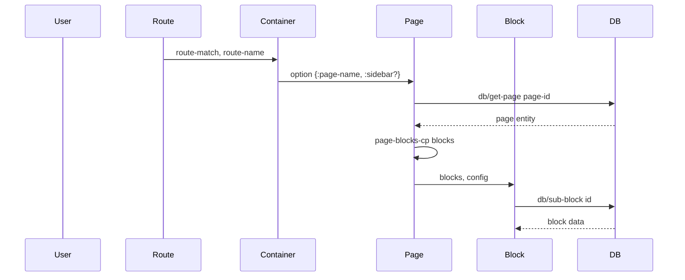
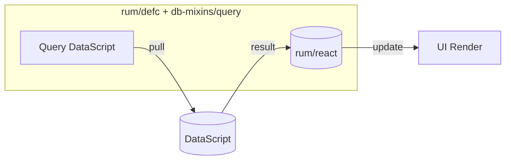
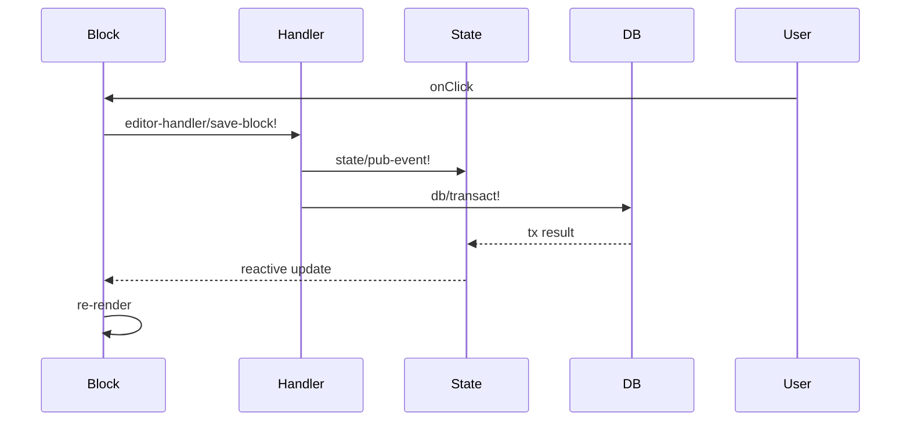
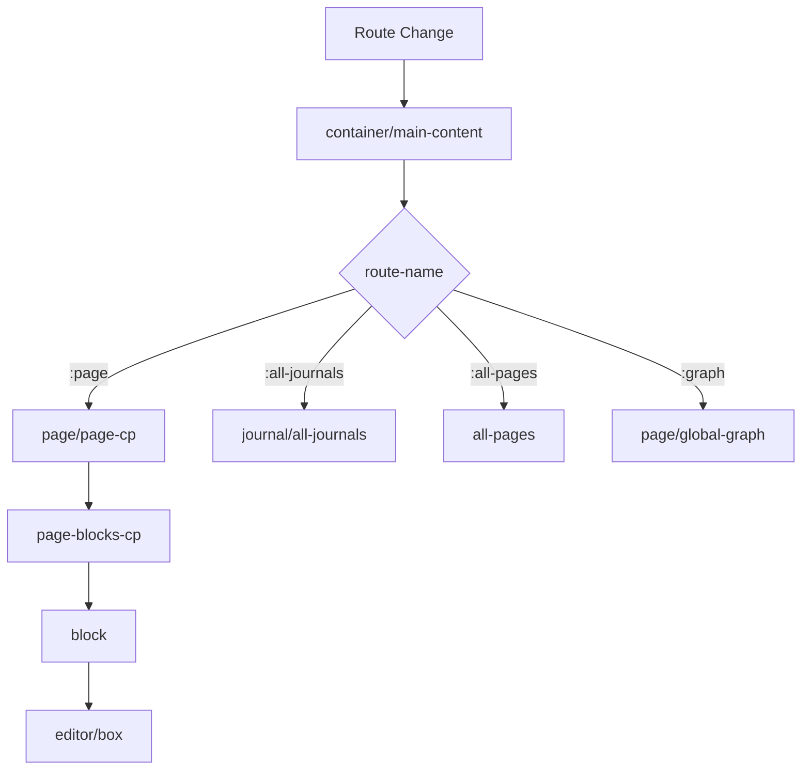
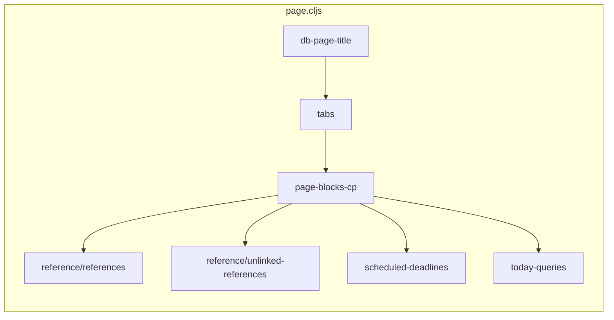
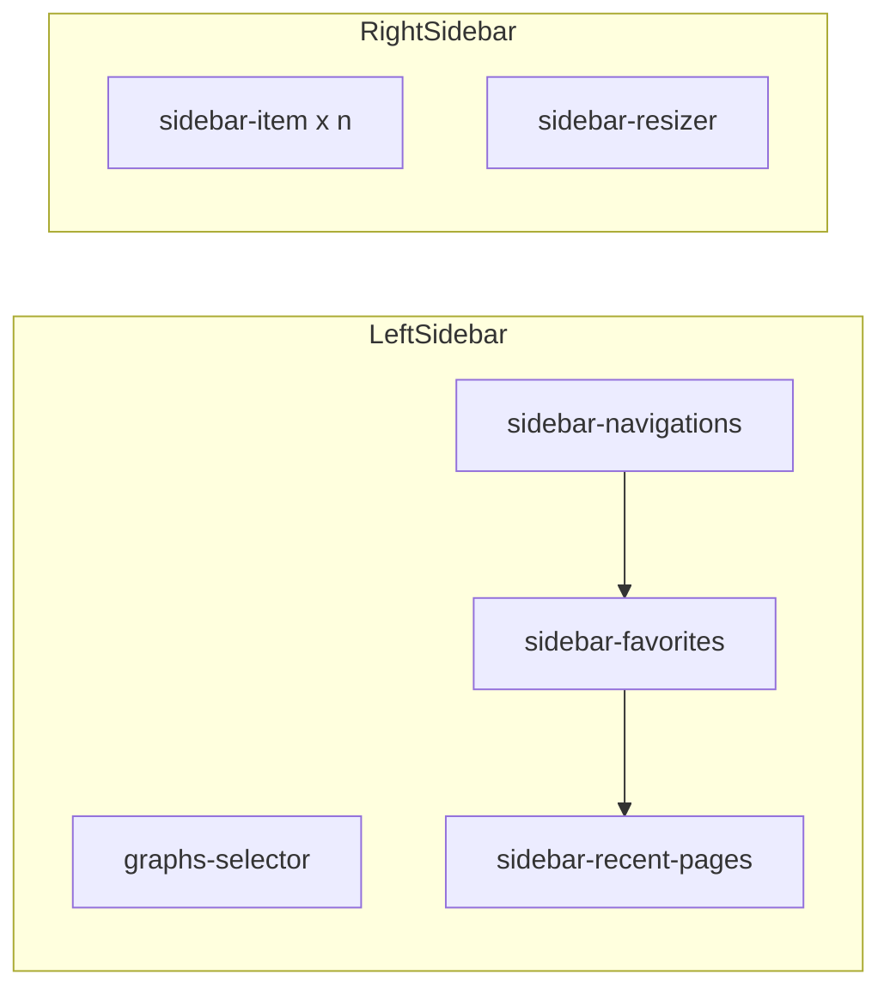
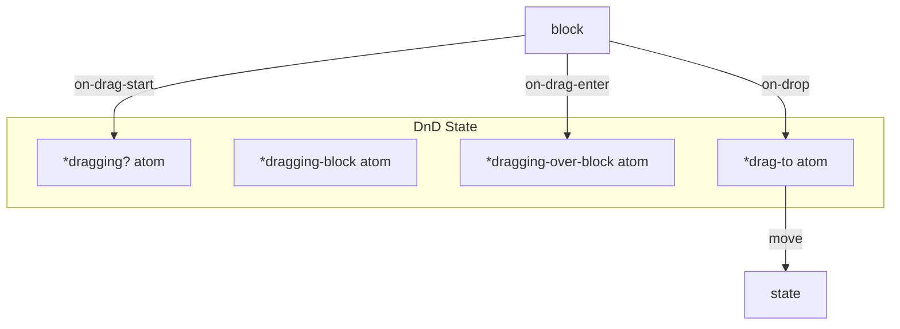

# Flowchart — frontend/components

> Generado por Archaeologist | Complejidad: HIGH

## Arquitectura de Componentes

```mermaid
flowchart TB
    subgraph Container["container.cljs - Contenedor Raíz"]
        root[root-container]
        main[main]
        main-content[main-content]
    end

    subgraph Header["header.cljs - Barra Superior"]
        header[header]
        help-btn[help-button]
    end

    subgraph LeftSidebar["left-sidebar.cljs - Navegación Izquierda"]
        sidebar[sidebar]
        sidebar-container[sidebar-container]
        sidebar-navigations[sidebar-navigations]
        sidebar-favorites[sidebar-favorites]
        sidebar-recent[sidebar-recent-pages]
    end

    subgraph RightSidebar["right-sidebar.cljs - Panel Derecho"]
        right-sidebar[sidebar]
        sidebar-item[sidebar-item]
        sidebar-inner[sidebar-inner]
    end

    subgraph Editor["editor.cljs - Editor de Texto"]
        editor-box[box]
        commands[commands]
        page-search[page-search]
        block-search[block-search]
        template-search[template-search]
        code-block-mode[code-block-mode-picker]
        shui-popups[shui-editor-popups]
    end

    subgraph Block["block.cljs - Componente de Bloque"]
        block[block]
        block-container[block-container]
        page-cp[page-cp]
        page-reference[page-reference]
        page-inner[page-inner]
        asset-container[asset-container]
        resizable-image[resizable-image]
        timestamp[timestamp]
        breadcrumb[breadcrumb]
    end

    subgraph Page["page.cljs - Vista de Página"]
        page-cp[page-cp]
        page-aux[page-aux]
        page-inner[page-inner]
        page-blocks-cp[page-blocks-cp]
        db-page-title[db-page-title]
        global-graph[global-graph]
        page-graph[page-graph]
    end

    subgraph Query["query.cljs - Sistema de Queries"]
        custom-query[custom-query]
        custom-query-inner[custom-query-inner]
        query-title[query-title]
    end

    subgraph QueryResult["query/result.cljs"]
        run-custom-query[run-custom-query]
        transform-query-result[transform-query-result]
    end

    subgraph Property["property/ - Sistema de Propiedades"]
        property[property]
        property-dialog[property-dialog]
        property-value[property-value]
        property-config[property-config]
    end

    subgraph State["frontend.state - Estado Global"]
        app-state[app-state atom]
        pub-event[pub-event!]
        sub[sub]
    end

    subgraph DB["frontend.db - DataScript"]
        db[db]
        db-mixins[db-mixins]
        react[db.react]
    end

    subgraph Handlers["frontend.handler - Event Handlers"]
        editor-handler[handler.editor]
        block-handler[handler.block]
        page-handler[handler.page]
        ui-handler[handler.ui]
    end

    %% Conexiones principales
    root --> header
    root --> left-sidebar
    root --> main
    root --> right-sidebar

    main --> main-content

    %% Editor y Block
    editor-box --> block
    editor-box --> shui-popups
    shui-popups --> commands
    shui-popups --> page-search
    shui-popups --> block-search
    shui-popups --> template-search

    block --> block-container
    block --> page-cp
    block --> page-reference
    block --> asset-container
    block --> timestamp
    block --> breadcrumb

    %% Page usa Block y Editor
    page-cp --> page-aux
    page-aux --> page-inner
    page-inner --> page-blocks-cp
    page-blocks-cp --> block
    page-inner --> db-page-title
    page-inner --> global-graph
    page-inner --> page-graph

    %% Query sistema
    custom-query --> custom-query-inner
    custom-query-inner --> query-title
    custom-query --> query-result

    %% Estado global
    block --> app-state
    editor-box --> app-state
    page-cp --> app-state
    custom-query --> app-state

    %% Queries DataScript
    page-blocks-cp --> db
    custom-query --> db
    page-cp --> db-mixins
    block --> db-mixins

    %% Handlers
    block --> editor-handler
    block --> block-handler
    editor-box --> editor-handler
    page-cp --> page-handler
```



## Flujo de Datos

### 1. Receiving Data (Props & State)



### 2. DataScript Queries (rum/reactive + db-mixins)



### 3. State Updates (Events)



## Patrones de Componentes Rum

### rum/defc (Functional Component)
```clojure
(rum/defc component-name < rum/reactive db-mixins/query
  [prop1 prop2]
  (let [local-state (rum/local nil ::local)
        reactive-data (rum/react some-atom)]
    [:div "content"]))
```

### rum/defcs (Stateful Component)
```clojure
(rum/defcs component-name < rum/reactive
  {:init (fn [state] ...)
   :did-mount (fn [state] ...)}
  [state prop1]
  (let [local (get state ::local)]
    [:div "content"]))
```

## Principales Mixins

| Mixin | Propósito |
|-------|----------|
| `db-mixins/query` | Ejecuta queries DataScript reactivas |
| `rum/reactive` | Suscribe a átomos de estado |
| `mixins/event-mixin` | Registra event listeners globales |
| `mixins/container-id` | Provee ID único para containers |

## Componentes Principales

### 1. container.cljs
**Props:** `route-match`, `main-content`, `route-name`
**Estado:** Sidebar open/closed, theme, settings
**Hijo de:** app root

### 2. block.cljs
**Props:** `block`, `config`, `sidebar?`
**Estado:** Dragging atoms, editing state
**Dependencias:** db, editor-handler, state

### 3. editor.cljs
**Props:** `format`, `block`, `id`, `config`
**Estado:** Editor action, input value, cursor position
**Dependencias:** state, handler.editor, db

### 4. page.cljs
**Props:** `page-name`, `repo`, `sidebar?`, `preview?`
**Estado:** Loading, page entity, refs count
**Dependencias:** block, editor, query, db

### 5. query.cljs
**Props:** `config`, `query`, `dsl-query?`
**Estado:** Query result, collapsed state, error
**Dependencias:** db.react, db-mixins, state

## Flujo de Navegación



## Composición de Página



## Sidebars



## Drag & Drop (DnD)



## Confianza del Análisis

| Aspecto | Confianza | Notas |
|---------|-----------|-------|
| Estructura de archivos | 🟢 Alta | Confirmada por glob |
| Composición de componentes | 🟢 Alta | Extraída directamente |
| Flujo de datos | 🟡 Media | Basado en patrones Rum |
| Mixins y lifecycle | 🟢 Alta | Confirmado en código |
| Handlers | 🟡 Media | Requiere verificar eventos |

## Archivos Analizados

- `container.cljs` (516 líneas)
- `block.cljs` (1165+ líneas)
- `editor.cljs` (771 líneas)
- `page.cljs` (1068 líneas)
- `all_pages.cljs` (36 líneas)
- `query.cljs` (235 líneas)
- `left_sidebar.cljs` (535 líneas)
- `right_sidebar.cljs` (528 líneas)

**Total: ~4300+ líneas de código analizado**
