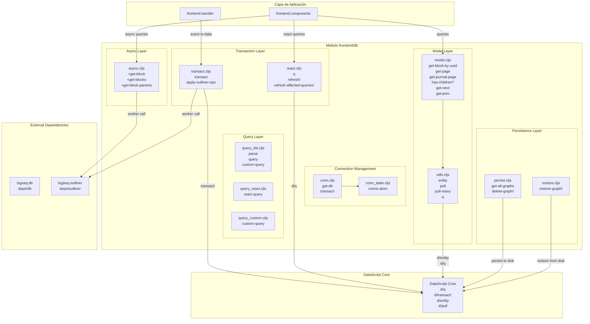
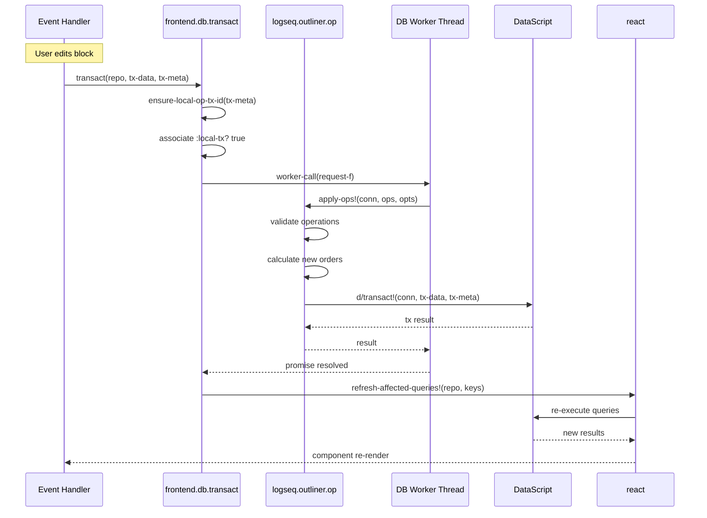
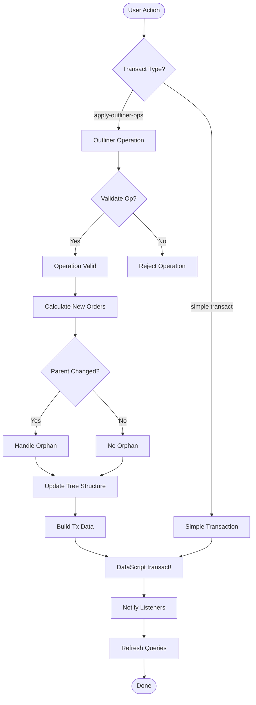
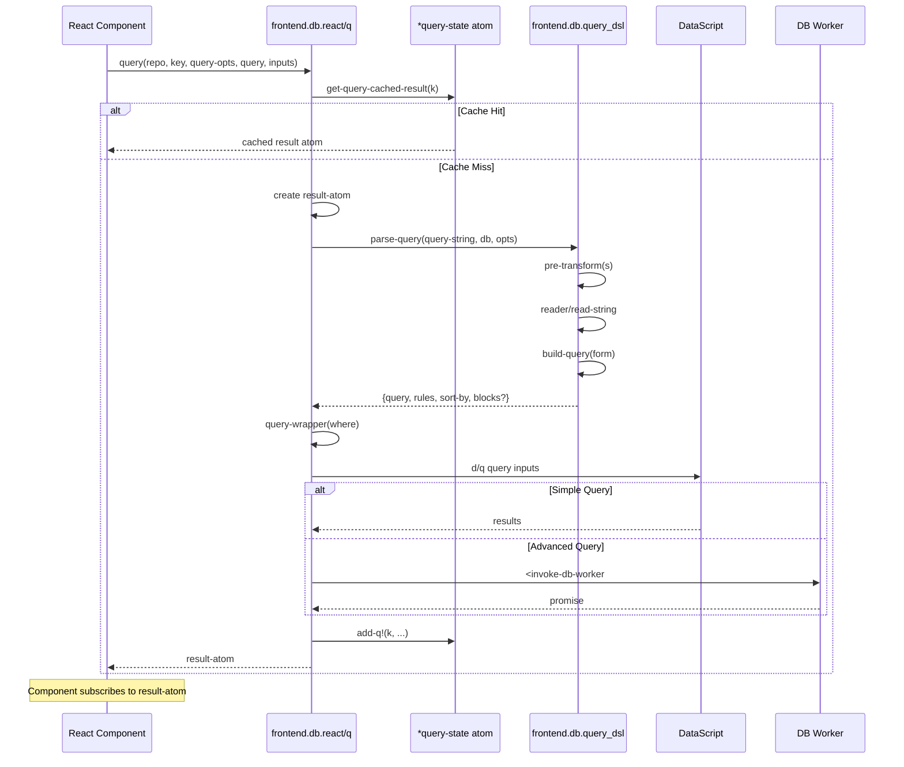
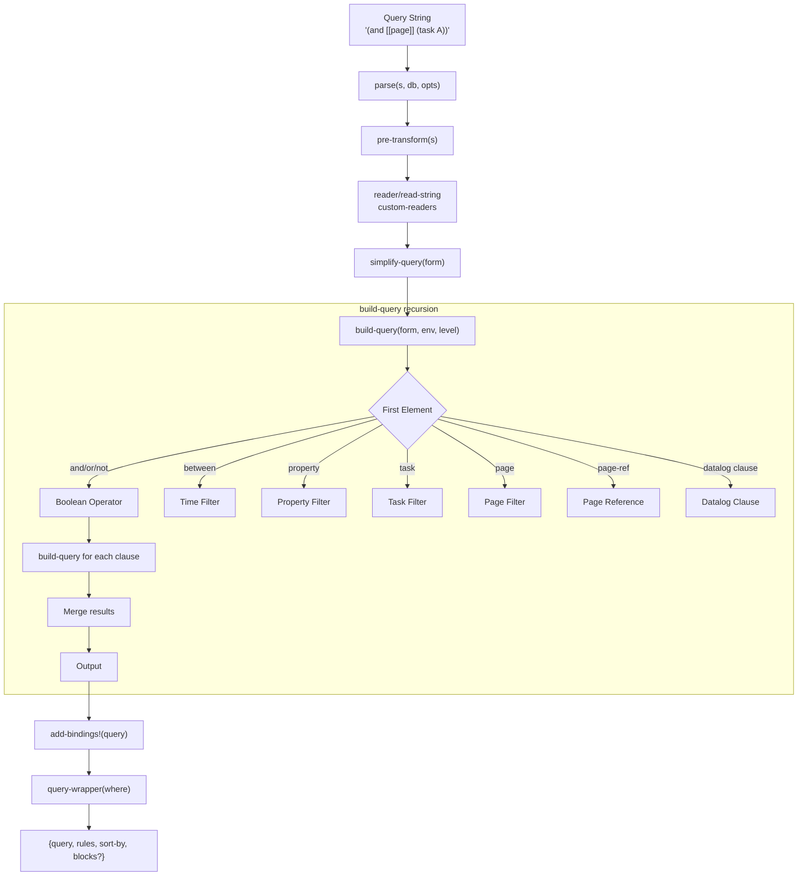
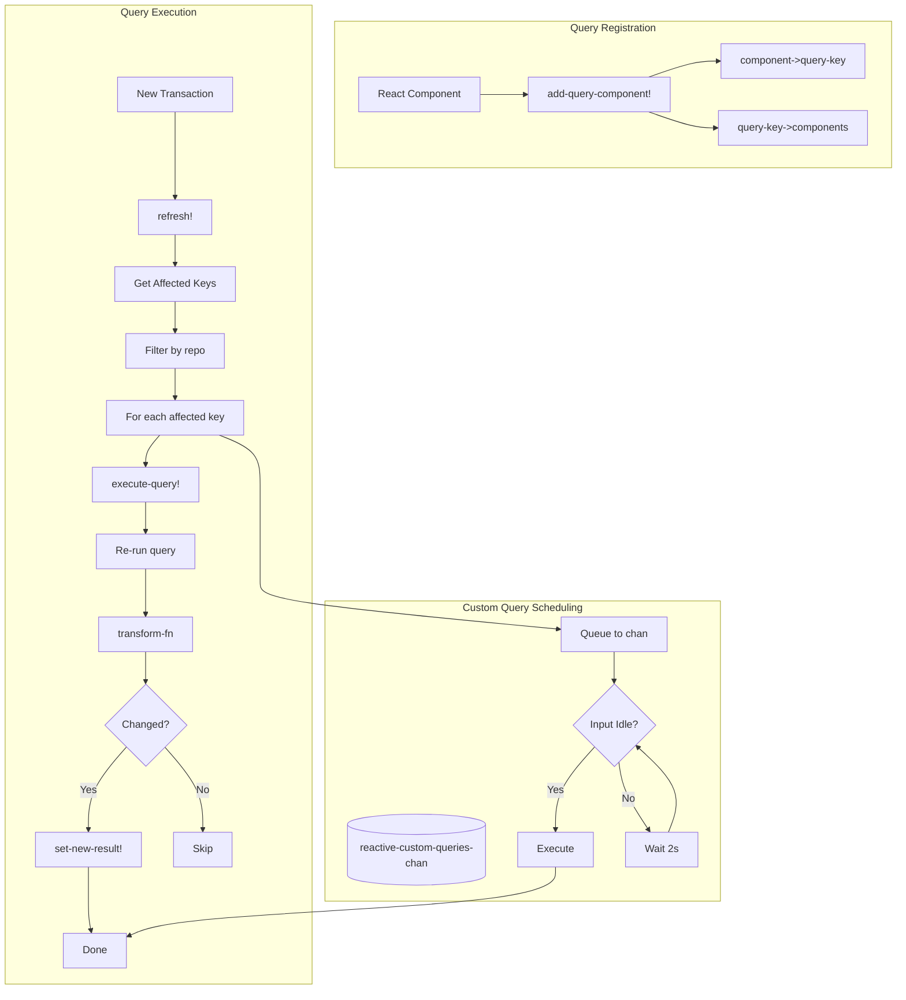
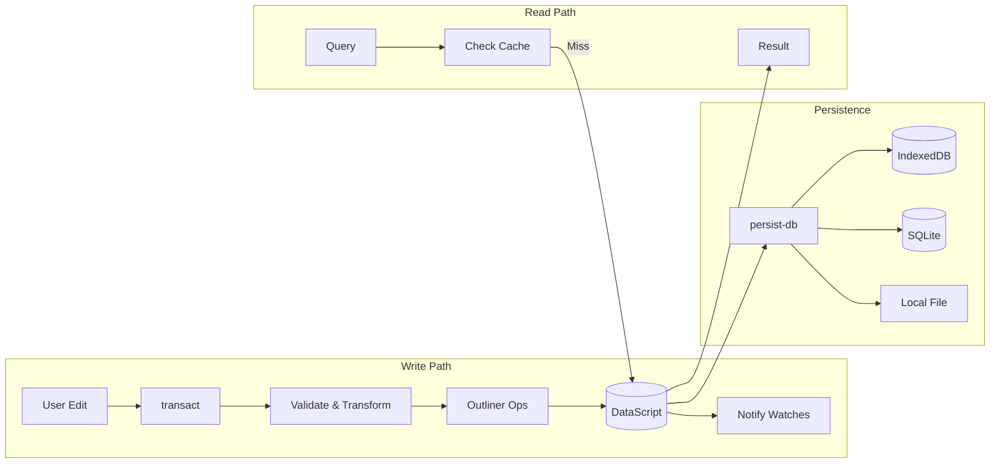
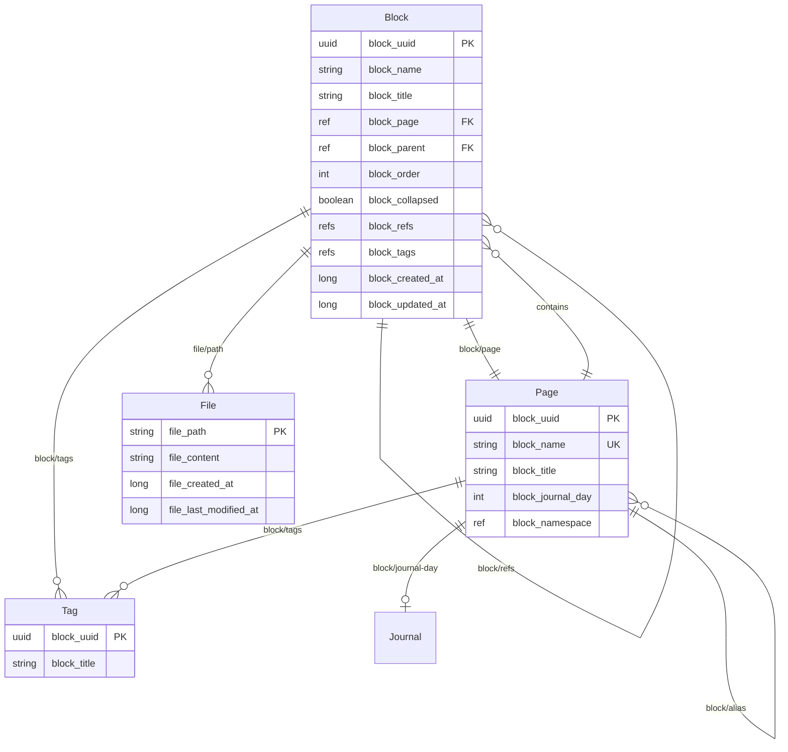
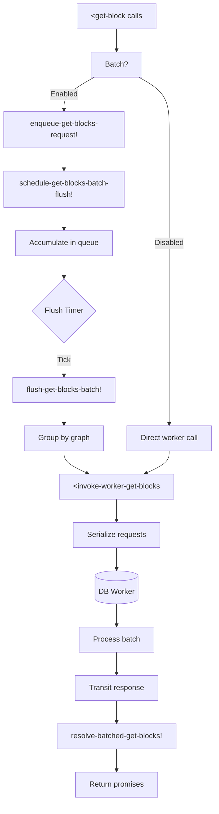

# Flowcharts — Módulo `frontend/db`

> Documentación detallada del flujo de datos en el módulo de base de datos DataScript de Logseq.

## 1. Arquitectura General del Módulo DB

## 2. Flujo de una Transacción Típica

### Detalle de Transacción con Outliner Ops

## 3. Flujo de Ejecución de Queries

### Query DSL Parser Flow

## 4. Reactive Query System

## 5. Bloqueo de Datos y Persistencia

## 6. Estructura de Datos DataScript - Schema

## 7. Batched Block Fetching

## Convenciones de Color

- 🟢 **Confirmado**: Extraído directamente del código fuente
- 🟡 **Inferido**: Basado en patrones observados
- 🔴 **Lacuna**: No determinable desde el código

## Métricas del Módulo

| Métrica | Valor |
|---------|-------|
| Archivos principales | 14 |
| Líneas de código | ~2,500 |
| Entidades schema | 4 (Block, Page, File, Tag) |
| Tipos de queries | 2 (DSL, Datalog puro) |
| Sistema reactivo | Yes (Rum reactive) |
| Concurrencia | core.async + promesa |
