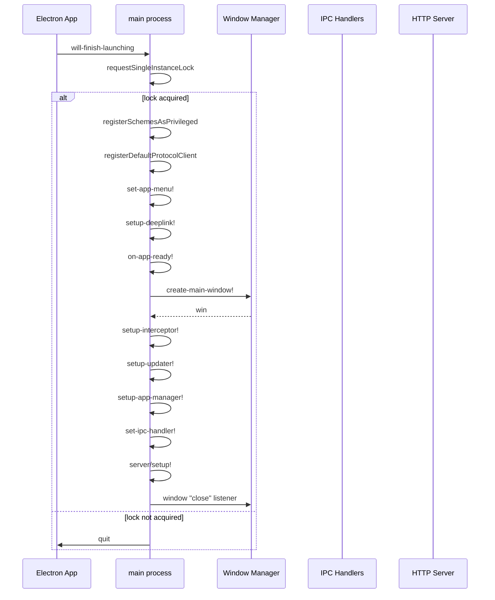
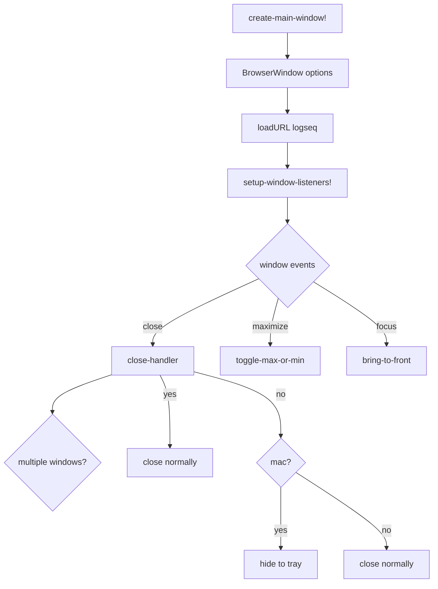
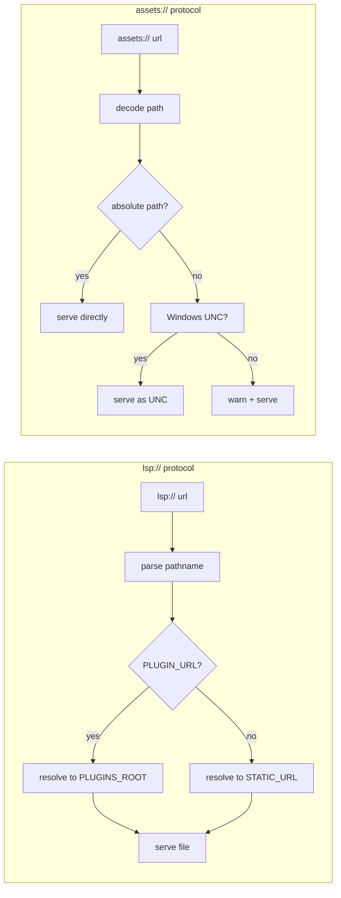
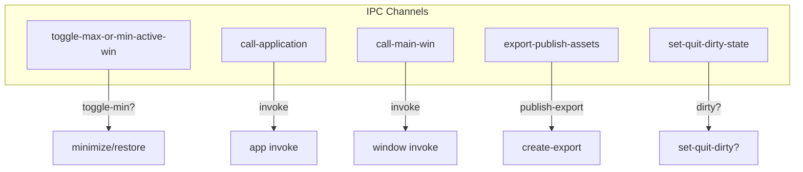
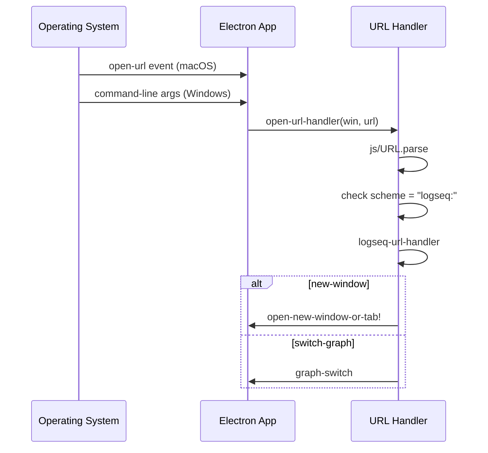
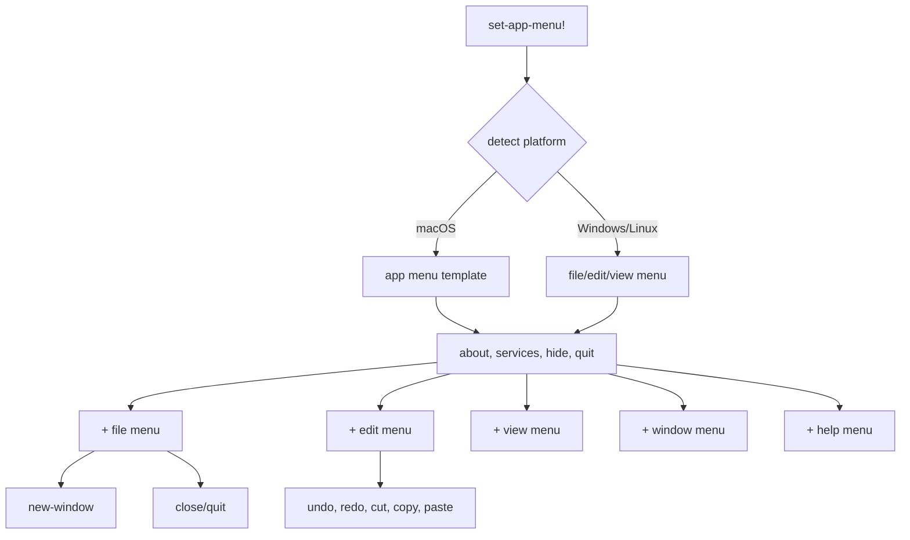
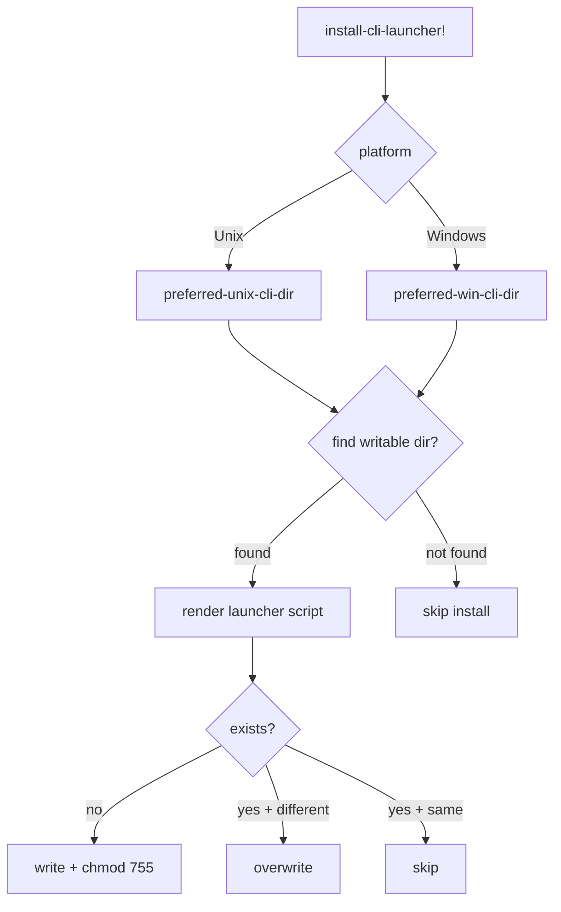

# Flowchart: electron - Desktop Application

> Flowchart del módulo Electron para la aplicación desktop.

## Inicialización Principal

## Window Management

## Protocol Handlers

## IPC Handler Setup

## Deep Link Handling

## App Menu Setup

## CLI Launcher Installation

---

*Flowchart generado por Reversa Archaeologist*
