# Flowcharts: fs, format, search

> Generated by reversa-archaeologist
> Confidence: 🟢 CONFIRMADO | 🟡 INFERIDO | 🔴 LACUNA

---

## Módulo FS (File System)

### Arquitectura General

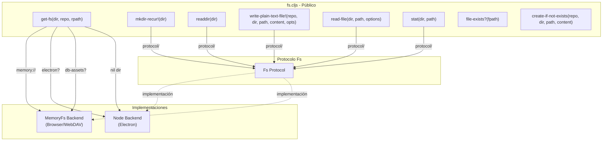

### Flujo Principal: get-fs Backend Selection

```mermaid
flowchart TD
    Start(["get-fs(dir, repo, rpath)"])
    
    Check1{db-assets? AND<br/>electron?}
    Check2{db-assets?}
    Check3{nil? dir}
    Check4{starts-with<br/>dir "memory://"}
    Check5{electron?}
    
    ResultNode["→ node-backend"]
    ResultMemory["→ memory-backend"]
    ResultError["→ throw ex-info"]
    
    Start --> Check1
    
    Check1 -->|"yes"| ResultNode
    Check1 -->|"no"| Check2
    
    Check2 -->|"yes"| ResultMemory
    Check2 -->|"no"| Check3
    
    Check3 -->|"yes"| ResultNode
    Check3 -->|"no"| Check4
    
    Check4 -->|"yes"| ResultMemory
    Check4 -->|"no"| Check5
    
    Check5 -->|"yes"| ResultNode
    Check5 -->|"no"| ResultError
```

### Flujo Principal: write-file!

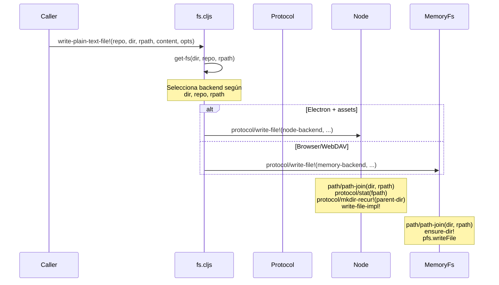

### Protocolo Fs - Métodos

```mermaid
classDiagram
    class Fs {
        <<protocol>>
        +mkdir!(dir) any
        +mkdir-recur!(dir) any
        +readdir(dir) [string]
        +unlink!(repo, path, opts) any
        +rmdir!(dir) any
        +read-file(dir, path, opts) string
        +read-file-raw(dir, path, opts) any
        +write-file!(repo, dir, path, content, opts) any
        +rename!(repo, old-path, new-path) any
        +copy!(repo, old-path, new-path) any
        +stat(path) {:type, :size, :mtime}
        +open-dir(dir) {:path, :files}
        +get-files(dir) [{:path, :content}]
        +watch-dir!(dir, options) any
        +unwatch-dir!(dir) any
    }

    class Node {
        +mkdir!()
        +readdir()
        +write-file!()
        +stat()
        +open-dir()
        +watch-dir!()
    }

    class MemoryFs {
        +mkdir!()
        +readdir()
        +write-file!()
        +stat()
        +open-dir() → nil
        +get-files() → nil
        +watch-dir!() → nil
    }

    Fs <|.. Node : implements
    Fs <|.. MemoryFs : implements
```

### MemoryFs - Algoritmo de mkdir-recur

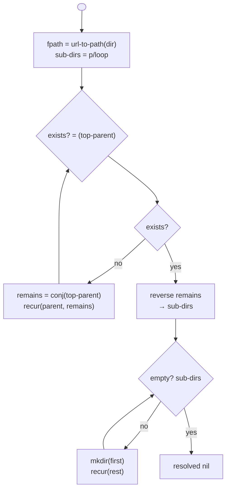

---

## Módulo FORMAT (Parsers)

### Arquitectura General

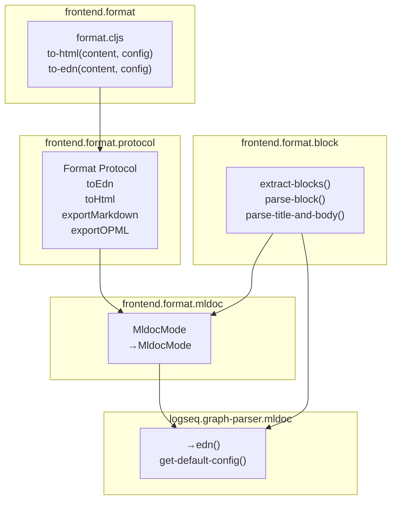

### Flujo: to-html

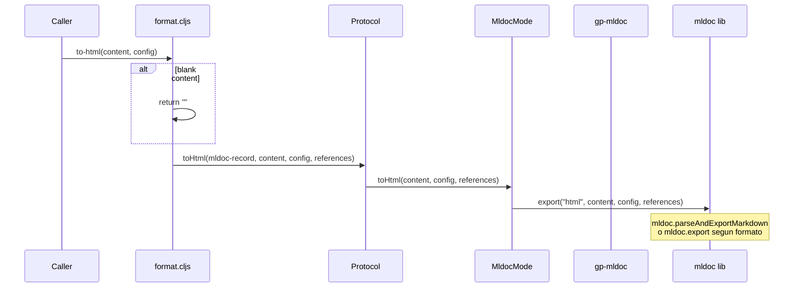

### Flujo: to-edn

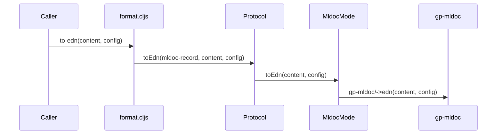

### Flujo: extract-blocks

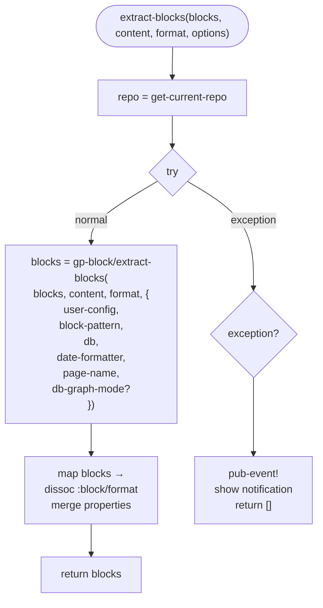

### Flujo: parse-title-and-body

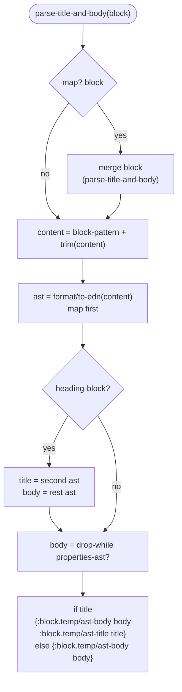

### Formatos Soportados

| Formato | Parser | Export |
|---------|--------|--------|
| Markdown | mldoc | HTML, EDN, Markdown, OPML |
| Org-mode | mldoc | HTML, EDN, Markdown, OPML |
| EDN | graph-parser | EDN only |

---

## Módulo SEARCH

### Arquitectura General - Agency Pattern

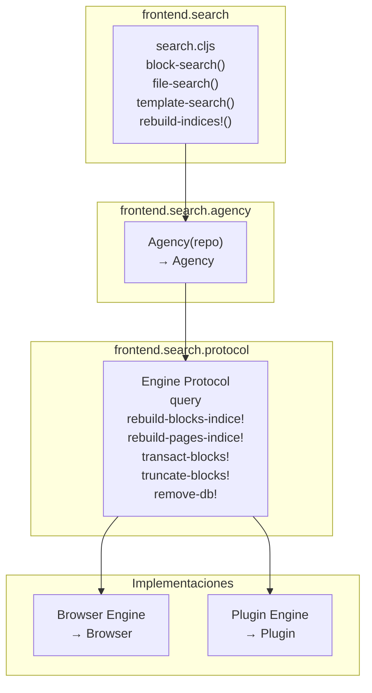

### Agency Pattern - Flujo de Query

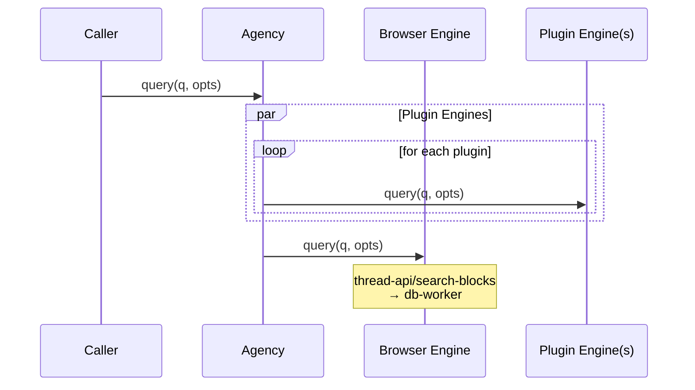

### Flujo: block-search

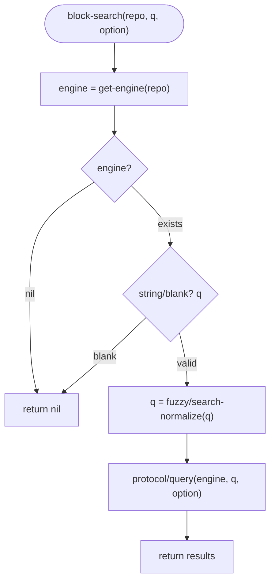

### Flujo: transact-blocks!

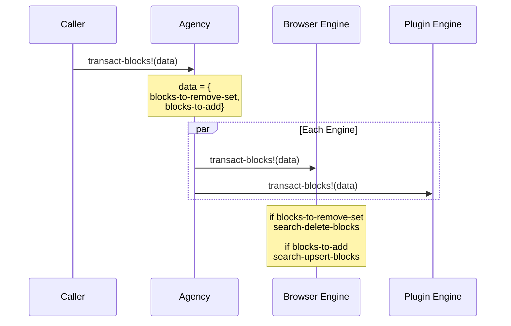

### Flujo: rebuild-indices!

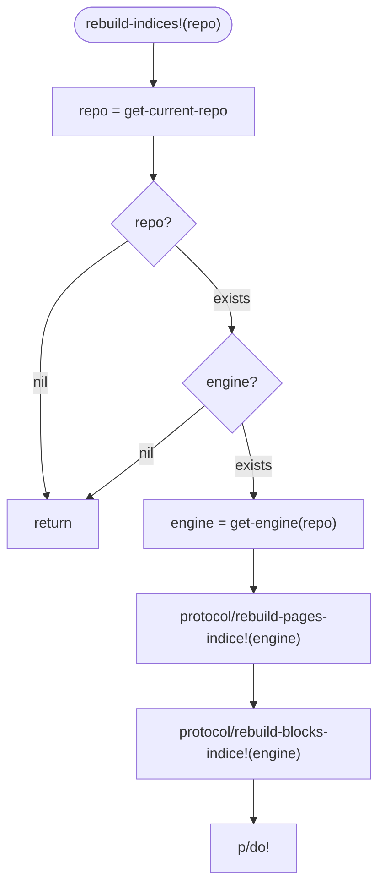

### Browser Engine - Transact Details

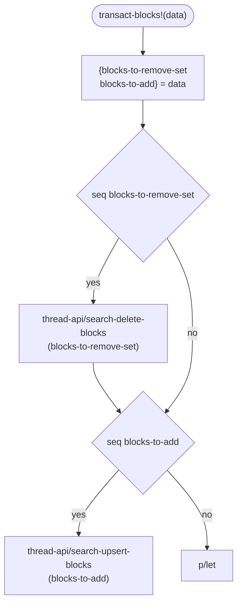

### Entidades Principales

| Entidad | Estructura | Propósito |
|---------|------------|-----------|
| BlockIndex | `{block-id, content, page}` | Índice de bloques para búsqueda |
| PageIndex | `{page-id, title, name}` | Índice de páginas |
| SearchResult | `{id, content, path, score}` | Resultado de búsqueda |

---

## Resumen de Complejidad

| Módulo | Complejidad | Algoritmos Principales |
|--------|-------------|------------------------|
| fs | 🟡 Media | Backend selection, recursive mkdir |
| format | 🟢 Baja | AST parsing, block extraction |
| search | 🟡 Media | Agency pattern, index management |
