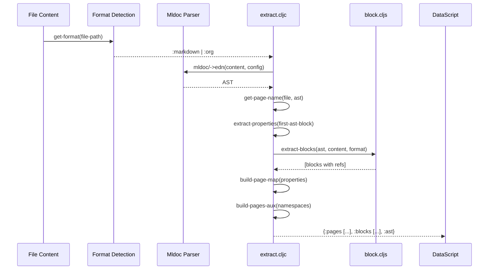
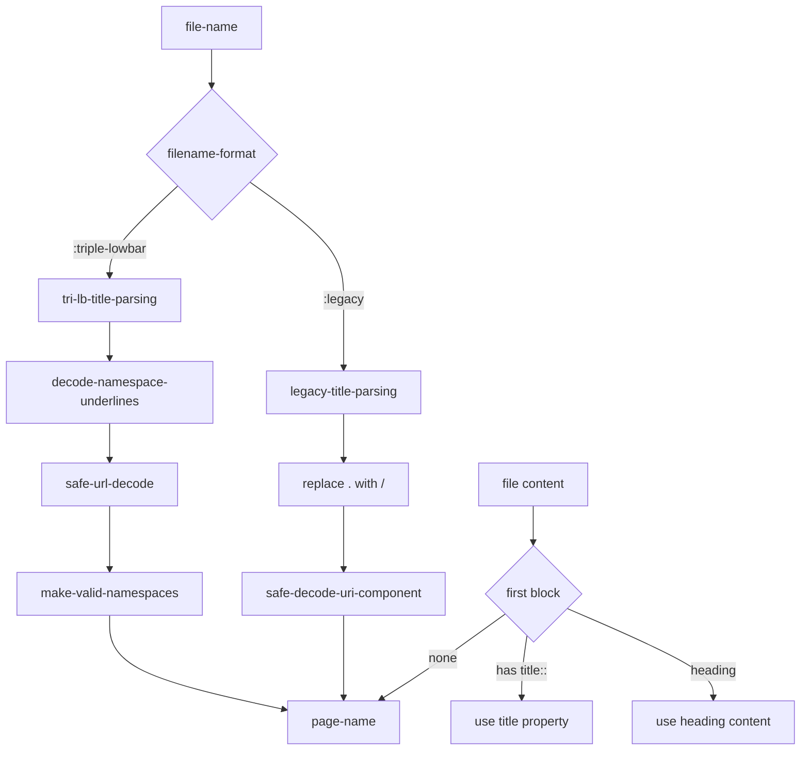
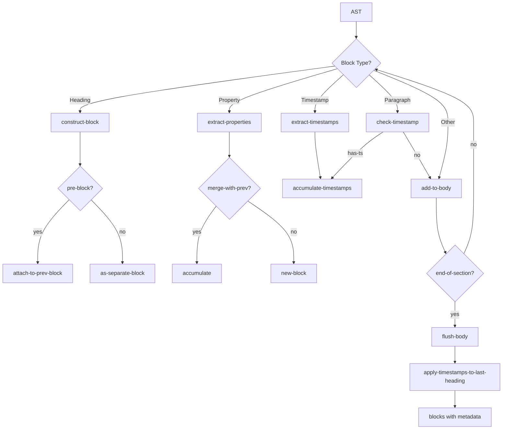
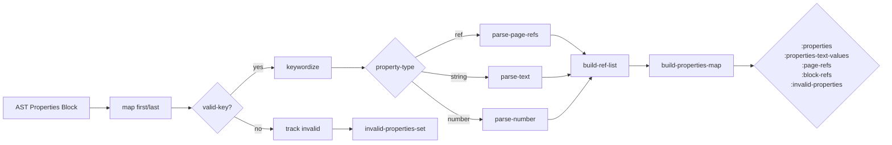
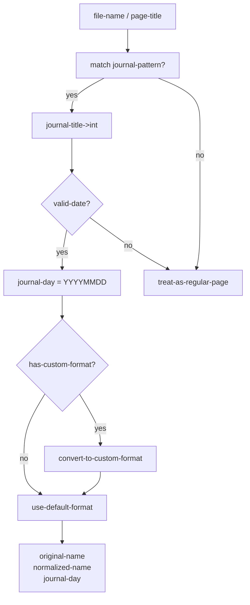
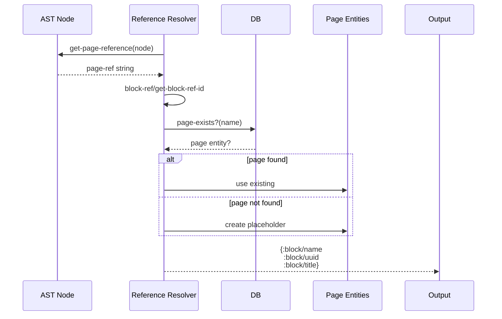
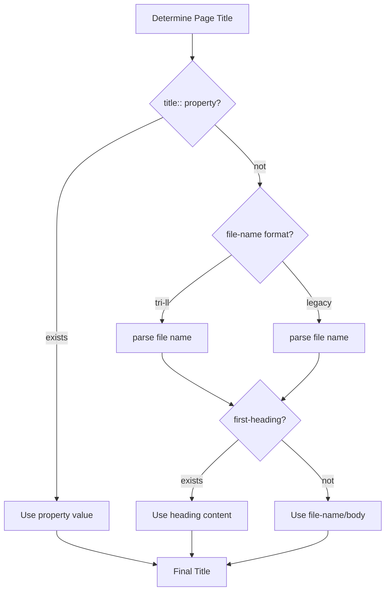

# Flowchart: graph-parser

> Flowchart del módulo de parsing de archivos a estructuras de datos.

## Flujo Principal de Extracción

## Page Name Parsing

## Block Extraction Pipeline

## Properties Extraction

## Journal Detection

## Reference Resolution

## Title Parsing Priority

---

*Flowchart generado por Reversa Archaeologist*
