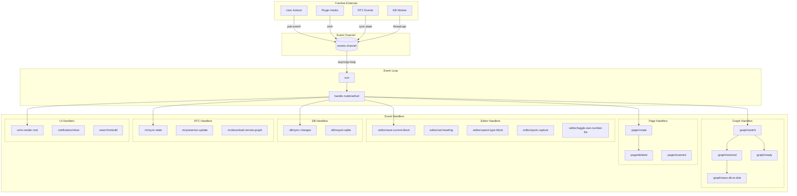
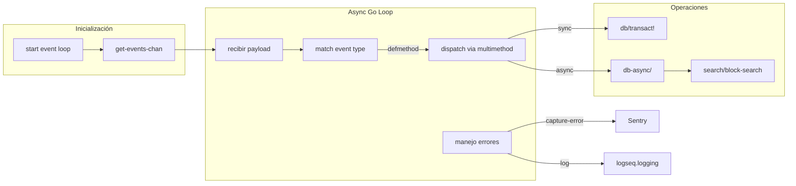
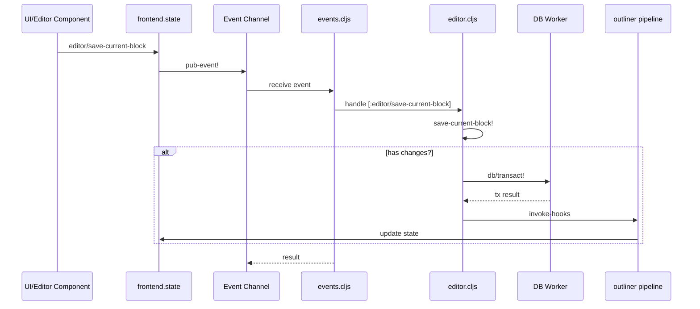
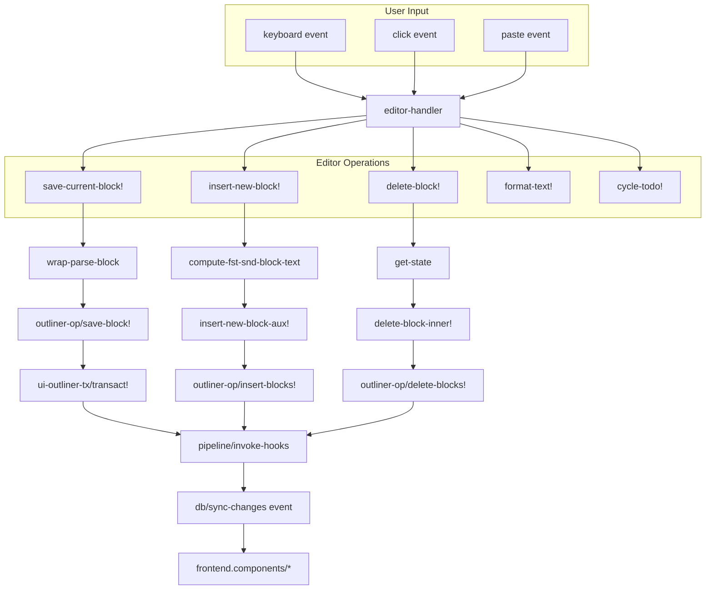
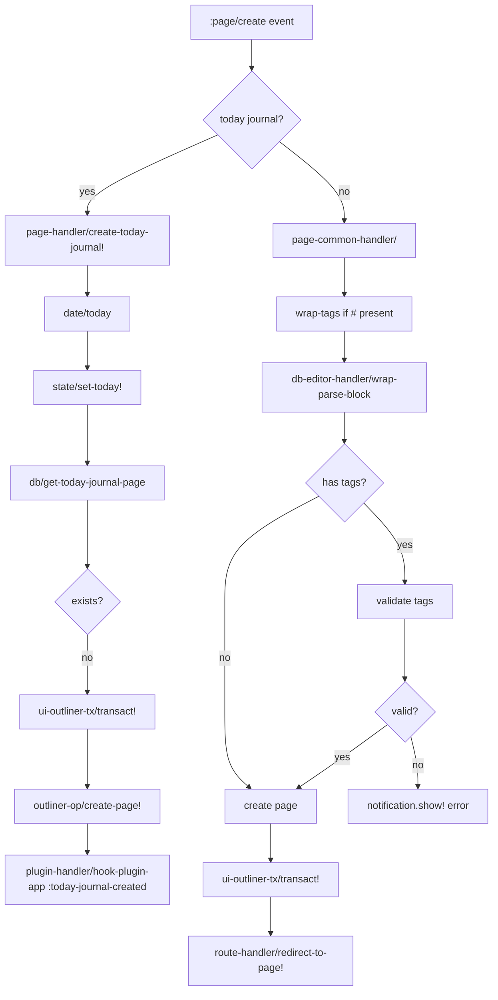
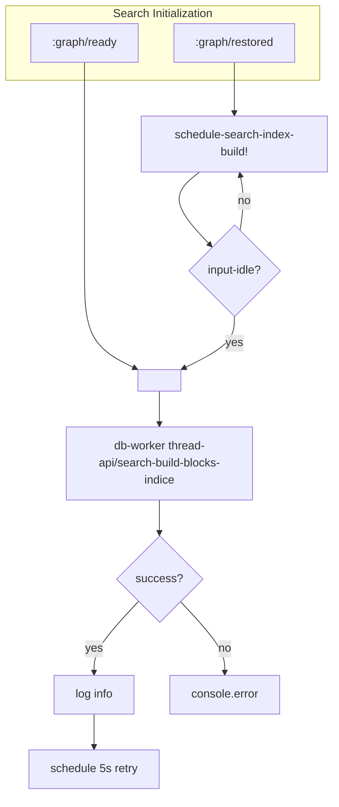
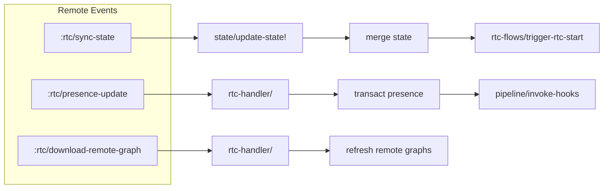
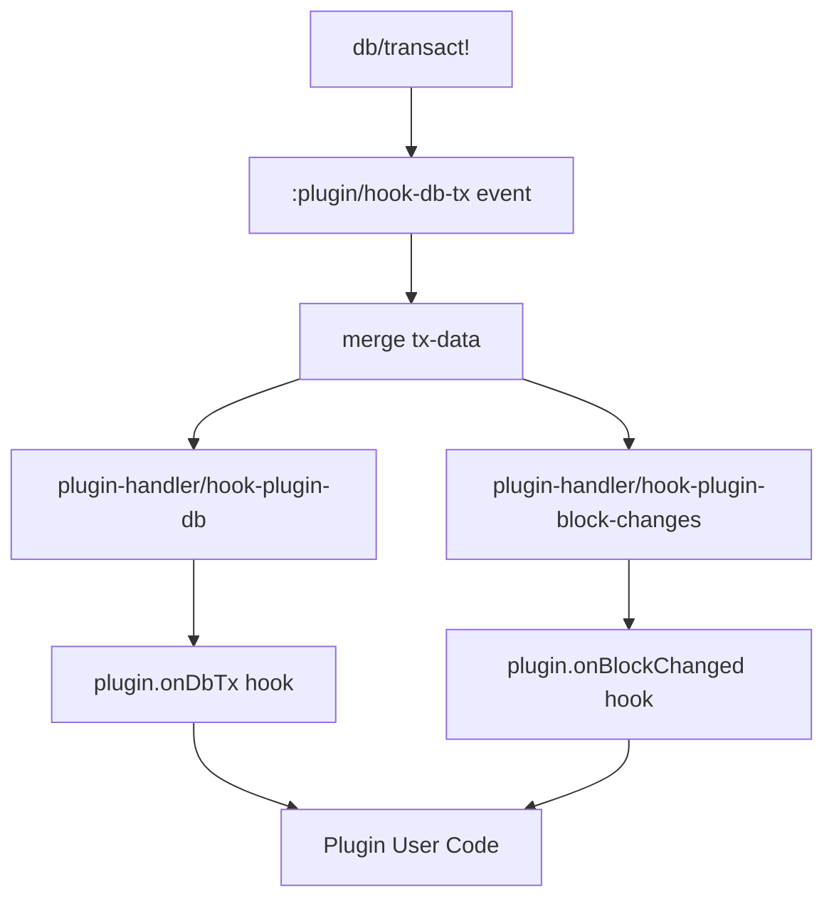
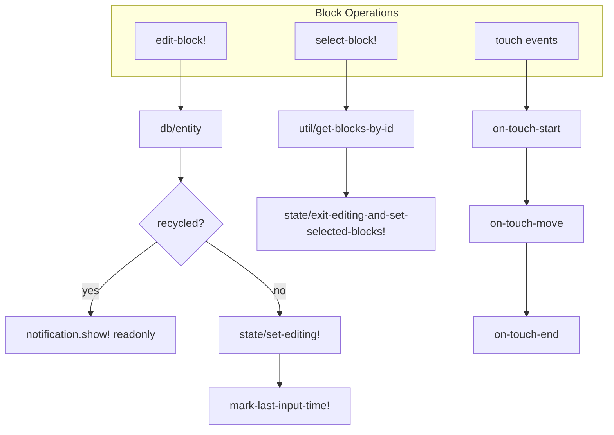
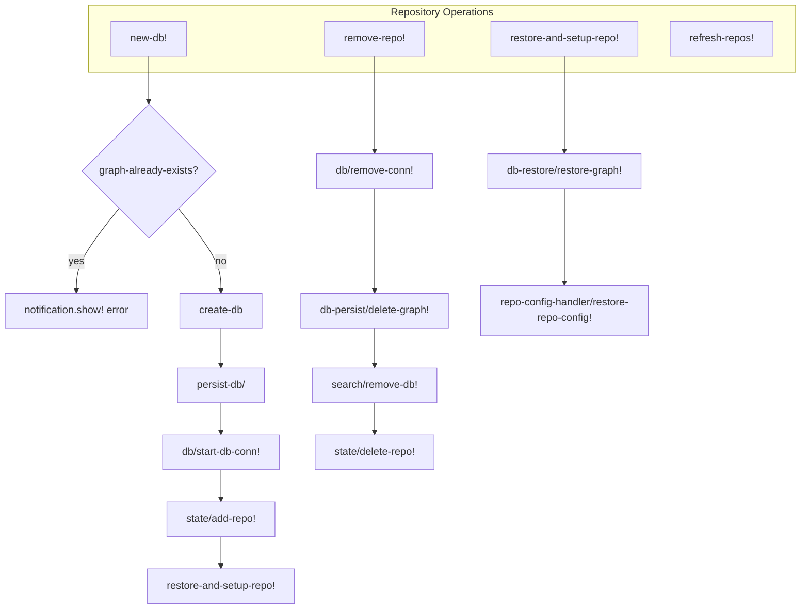

# Flowchart: frontend/handler - Event Handlers

> Flowchart detallado del sistema de eventos centralizado de Logseq.
> Generado por Reversa Archaeologist | Nivel: detalhado

## 1. Arquitectura General del Sistema de Eventos



## 2. Event Loop Principal (events.cljs)



### Código del Event Loop (events.cljs:419-439)

```
run! → async/go-loop → handle (multimethod)
                           ↓
                      try/catch
                           ↓
              p/then (resolve result)
              p/catch (log error + capture-error)
```

## 3. Flujo de Evento de Edición (editor.save)



## 4. Graph Switch Flow Detallado

```mermaid
flowchart TD
    A[:graph/switch event] --> B[export/cancel-db-backup!]
    B --> C[state/set-state! :db/async-queries {}]
    C --> D[st/refresh!]
    D --> E[graph-switch-on-persisted]

    E --> F[repo-handler/restore-and-setup-repo!]
    F --> G[db-restore/restore-graph!]
    G --> H[repo-config-handler/restore-repo-config!]
    H --> I{global-config-enabled?}

    I -->|yes| J[global-config-handler/restore!]
    I -->|no| K[continuar]
    J --> K

    K --> L[ui-handler/add-style-if-exists!]
    L --> M[graph-switch]
    M --> N[page-handler/init-commands!]
    N --> O[repo-config-handler/restore-repo-config!]
    O --> P[route-handler/redirect-to-home!]
    P --> Q[graph-handler/settle-metadata-to-local!]

    Q --> R{rtc-download?}
    R -->|yes| S[repo-handler/refresh-repos!]
    R -->|no| T[schedule-search-index-build!]

    S --> T
    T --> U[export/backup-db-graph]
    U --> V[log info]

    style R fill:#f9f,stroke:#333
```

## 5. Editor Operations Flow



## 6. Page Create Flow



## 7. Search System Flow



## 8. RTC Collaboration Flow



## 9. Plugin Hook System



## 10. Block Handler (block.cljs) - Operaciones Principales



## 11. Repo Handler (repo.cljs) - Gestión de Grafos



## 12. Estructura de Archivos del Módulo Handler

```
handler/
├── events.cljs              # Event loop principal (multimethod handle)
├── events/
│   ├── ui.cljs              # UI events (dialogs, modals, etc)
│   ├── rtc.cljs             # Real-time collaboration events
│   └── export.cljs          # Export events
├── editor.cljs              # ~3600 líneas - Editor principal
├── editor/
│   └── lifecycle.cljs        # Editor lifecycle
├── page.cljs                # Page utilities
├── block.cljs               # Block utilities
├── repo.cljs                # Repository/graph management
├── search.cljs             # Search handling
├── ui.cljs                 # UI state management
├── common/
│   ├── editor.cljs         # Shared editor utilities
│   ├── page.cljs           # Shared page utilities
│   └── ...
├── db_based/
│   ├── editor.cljs         # DB-based editor ops
│   ├── page.cljs           # DB-based page ops
│   ├── property.cljs       # Property handling
│   ├── rtc_flows.cljs     # RTC flows
│   └── sync.cljs           # DB sync
└── ... (50+ archivos más)
```

---

## Key Findings

| Aspecto | Detalle |
|---------|---------|
| **Event Loop** | core.async channel + multimethod dispatch |
| **Error Handling** | try/catch + Sentry capture + logging |
| **Transactions** | promesa.core promises + p/do! pattern |
| **State Updates** | pipeline/invoke-hooks → component re-render |
| **Plugin Integration** | hook-db-tx y onBlockChanged hooks |
| **RTC** | WebSocket state sync + presence updates |

**Escala de Confianza:**
- 🟢 CONFIRMADO: Event loop, multimethod dispatch, editor operations
- 🟢 CONFIRMADO: Page create/delete/rename flows
- 🟢 CONFIRMADO: Graph switch y repo management
- 🟡 INFERIDO: RTC internals (requiere código de electron)
- 🟡 INFERIDO: Plugin hook implementation details

---

*Flowchart generado por Reversa Archaeologist*
