# Flowchart: frontend/fs - File System

> Flowchart del sistema de archivos abstracto.

## Protocolo Fs - Métodos Principales

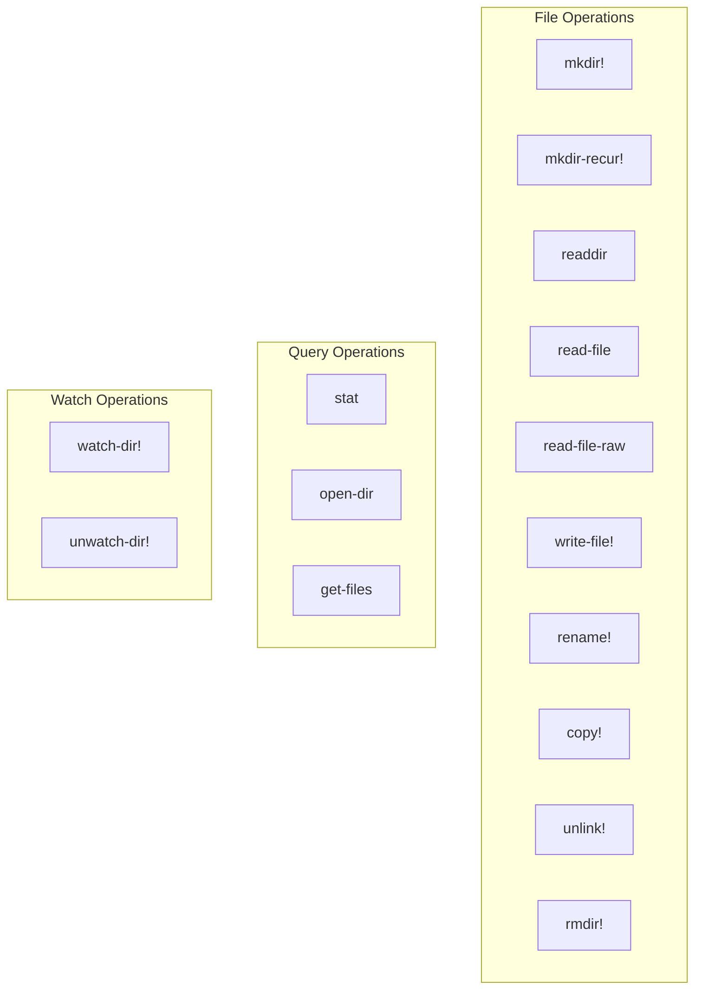

## Implementaciones del Protocolo

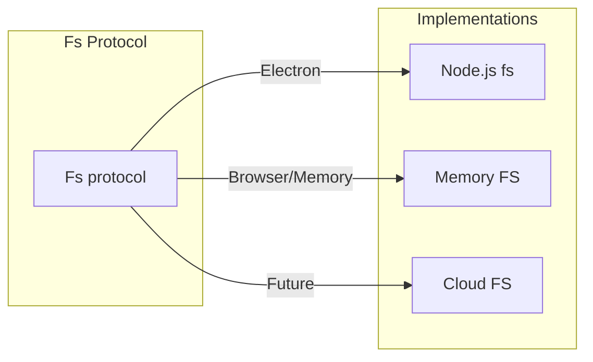

## Write File Flow

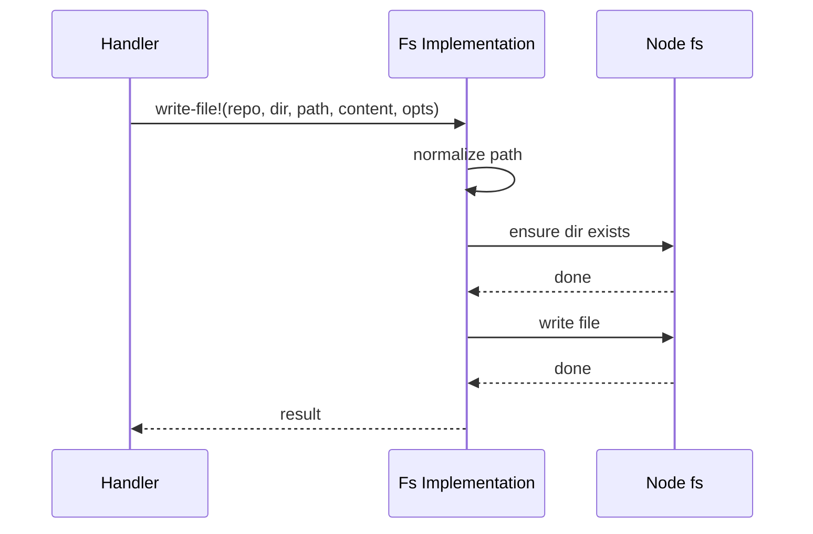

---

# Flowchart: frontend/format - Parsers

> Flowchart del sistema de parsing Markdown y Org-mode.

## Formato Protocol

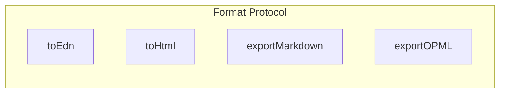

## Mldoc Pipeline

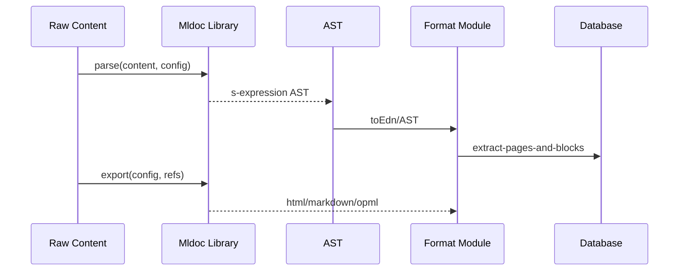

## AST Node Types

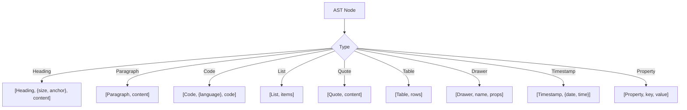

---

# Flowchart: frontend/search - Búsqueda

> Flowchart del sistema de búsqueda.

## Agency Pattern

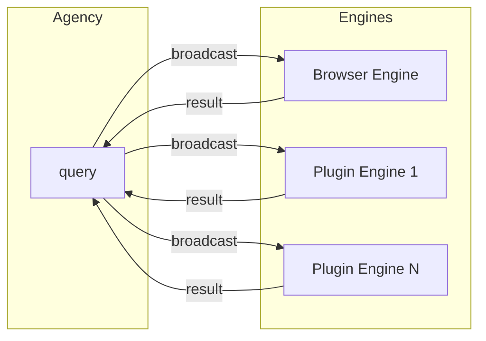

## Search Flow

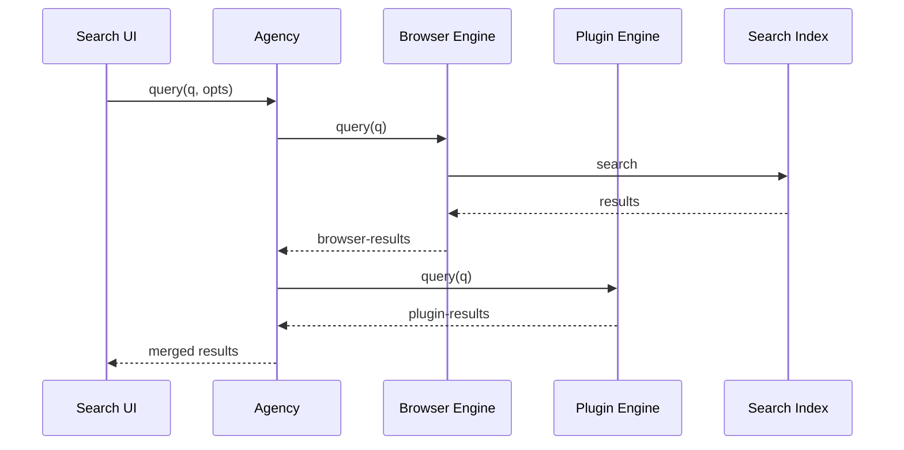

## Index Operations

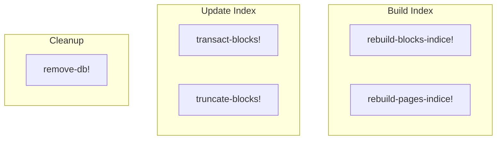

---

# Flowchart: frontend/components - UI Components

> Flowchart del sistema de componentes UI.

## Editor Component Architecture

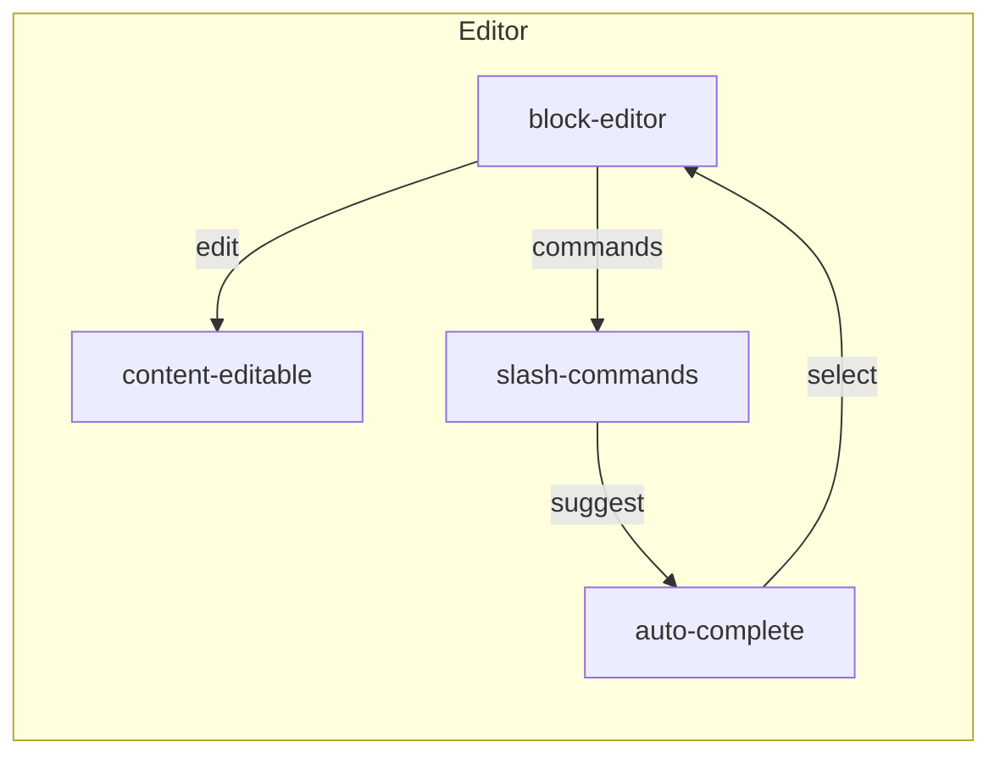

## Block Rendering Pipeline

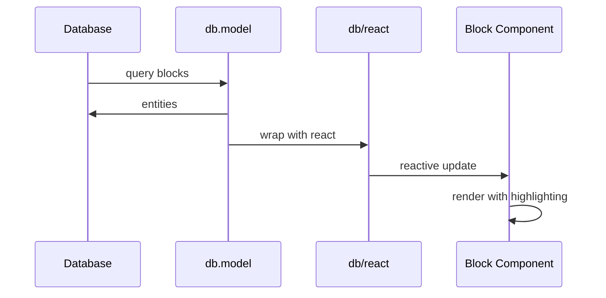

## Command Palette Flow

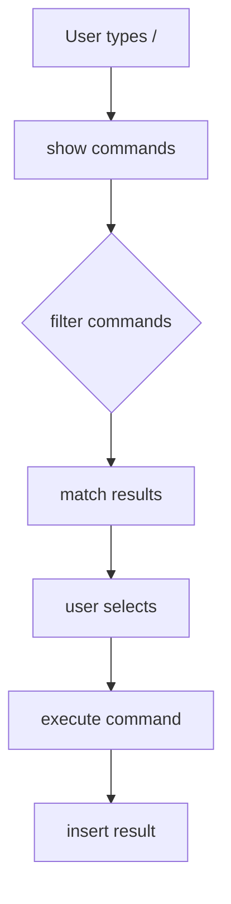

---

*Flowcharts generados por Reversa Archaeologist*
