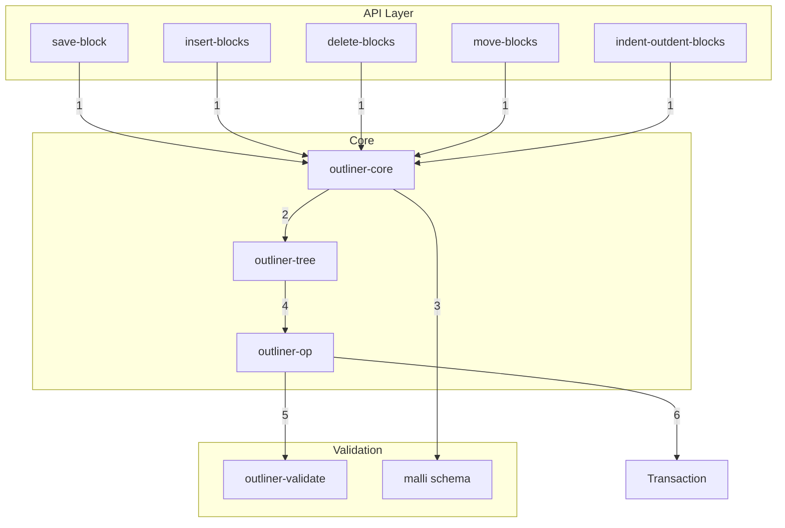
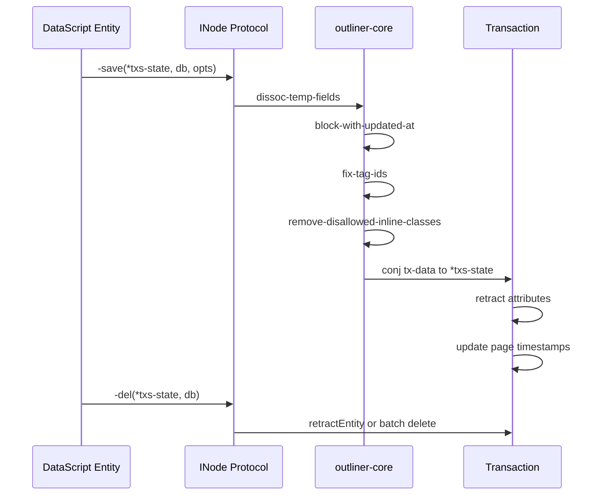
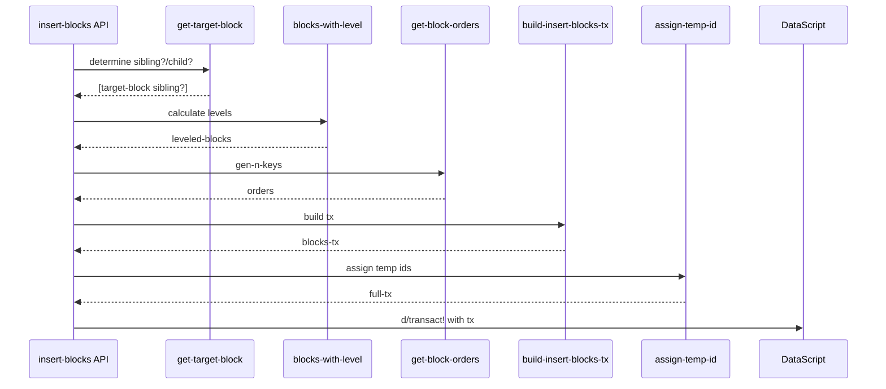
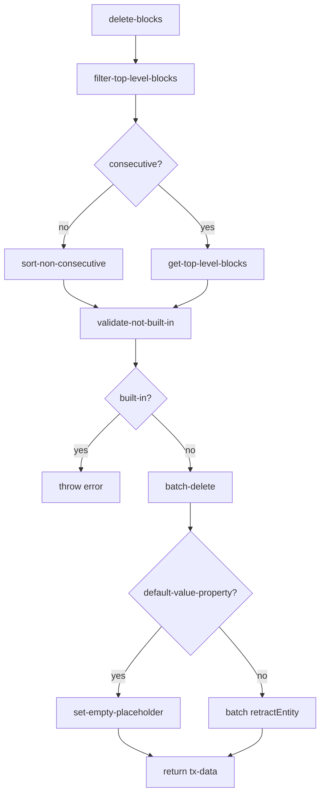
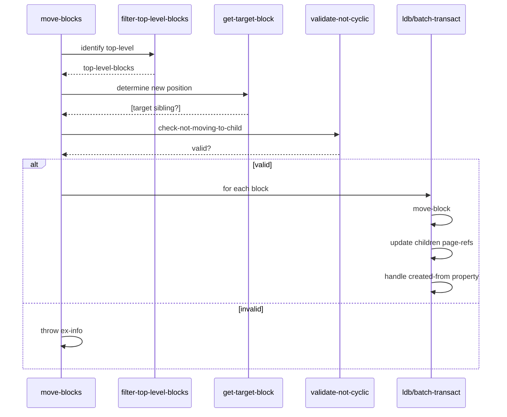
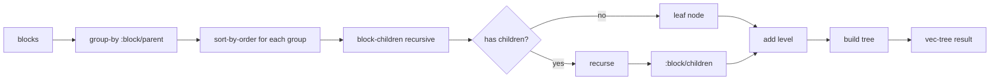
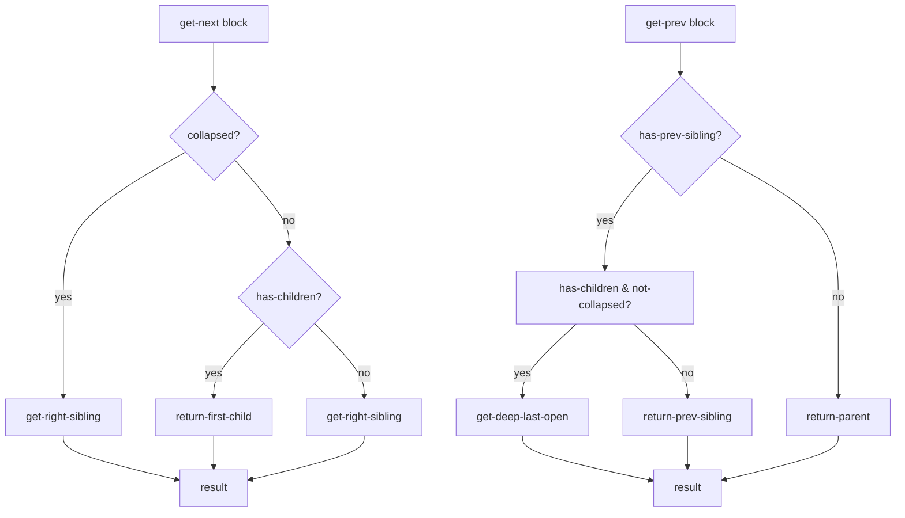
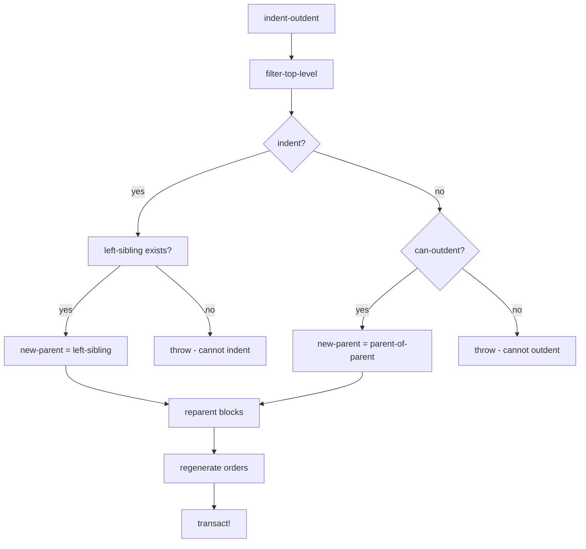
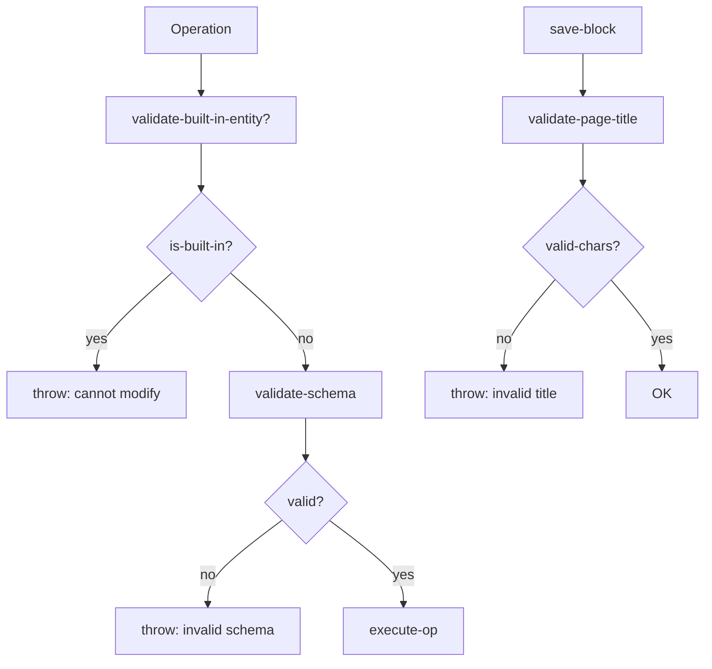

# Flowchart: outliner - Sistema Outliner

> Flowchart del sistema de operaciones de árbol/outliner.

## Arquitectura de Operaciones

## Protocolo INode

## Insert Blocks Flow

## Delete Blocks Flow

## Move Blocks Flow

## Tree to Vec Conversion

## Block Navigation

## Indent/Outdent Algorithm

## Operation Validation

---

*Flowchart generado por Reversa Archaeologist*
