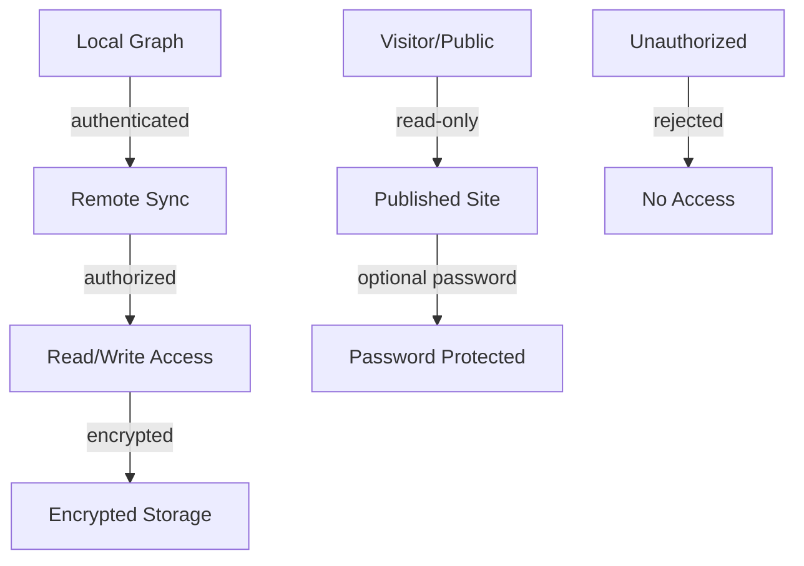

# Permissions Matrix - Logseq

> Análisis de permisos y sistema de acceso del proyecto Quilt.
> Generado por: reversa-detective
> Fecha: 2026-05-02
Proyecto: Quilt
> Nivel: completo

---

## 1. RBAC/ACL - Análisis

### 1.1 Conclusión Principal

**🔴 HALLAZGO CLAVE**: Logseq es un **PKM (Personal Knowledge Management)** diseñado para uso **individual/local**.

**NO EXISTE Sistema RBAC Multi-Usuario**:
- No hay roles de usuario (admin, editor, viewer)
- No hay permisos por usuario
- No hay control de acceso a nivel de grafo para múltiples usuarios
- No hay compartición de gráficos en tiempo real (a diferencia de Notion)

**Lo que SÍ existe**:
- Sistema de publicación con páginas públicas/privadas
- Sistema de sincronización con encryption (E2EE)
- Sistema de plugins con API controlada

---

## 2. Sistema de Publicación (Publishing)

### 2.1 Publication Access Model

```
┌─────────────────────────────────────────────────────────────────────┐
│                                                                      │
│   GRAPH OWNER (Local)                                                │
│   ┌─────────────────────────────────────────────────────────────┐   │
│   │                                                              │   │
│   │   Page-Level Publishing Settings                              │   │
│   │   ┌─────────────┐  ┌─────────────┐  ┌─────────────────┐   │   │
│   │   │ publishing- │  │ publishing- │  │ all-pages-       │   │   │
│   │   │ public?     │  │ slug/url    │  │ public?          │   │   │
│   │   │ (per page)  │  │ (per page)  │  │ (global flag)   │   │   │
│   │   └─────────────┘  └─────────────┘  └─────────────────┘   │   │
│   │                                                              │   │
│   └─────────────────────────────────────────────────────────────┘   │
│                              │                                     │
│                              ▼                                     │
│   ┌─────────────────────────────────────────────────────────────┐   │
│   │  PUBLISHED SITE (Read-Only for Visitors)                    │   │
│   │                                                              │   │
│   │  ┌─────────────────────────────────────────────────────┐   │   │
│   │  │ Visitor (with password if protected)                │   │   │
│   │  └─────────────────────────────────────────────────────┘   │   │
│   │                                                              │   │
│   └─────────────────────────────────────────────────────────────┘   │
│                                                                      │
└─────────────────────────────────────────────────────────────────────┘
```

### 2.2 Publication Permission Levels

| Level | Config | Access |
|-------|--------|--------|
| **Global Public** | `all-pages-public? = true` | Todas las páginas son públicas |
| **Per-Page Public** | `publishing-public? = true` | Solo páginas marcadas son públicas |
| **Password Protected** | Página individual con contraseña | Requiere contraseña |
| **Private** | `publishing-public? = false` | No publicada |

### 2.3 Publication Access Control Features

**Confirmed Features** (del código):

```clojure
;; En frontend/publishing.cljs
(defn all-pages-public?
  []
  (let [value (:publishing/all-pages-public? (get-config))
        value (if (some? value) value (:all-pages-public? (get-config)))]
    value))
```

**Git Log Evidence**:
```
fix(publish): hide protected pages from ref and user listings
fix(publish): hide protected page content from tag listings
fix(publish): remove public /pages listing endpoint
fix(publish): hide hidden properties in page render
fix(publish): keep legacy short/page URL compatibility
feat: configurable publish server URL
```

**Protection Mechanisms**:
- 🟢 **CONFIRMADO**: Páginas protegidas ocultas de listados públicos
- 🟢 **CONFIRMADO**: Propiedades protegidas no visibles en publicación
- 🟢 **CONFIRMADO**: Endpoint `/pages` eliminado (no listado público)
- 🟢 **CONFIRMADO**: Slugs legacy soportados para backward compatibility

---

## 3. Sincronización y Encryption (E2EE)

### 3.1 Sync Access Model

```
┌─────────────────────────────────────────────────────────────────────┐
│                                                                      │
│   LOCAL GRAPH                                                       │
│   ┌─────────────────────────────────────────────────────────────┐   │
│   │                                                              │   │
│   │   E2EE Encryption                                            │   │
│   │   ┌─────────────────────────────────────────────────────┐   │   │
│   │   │  Password ────► Key Derivation ────► Encrypted      │   │   │
│   │   │                                      Content        │   │   │
│   │   └─────────────────────────────────────────────────────┘   │   │
│   │                                                              │   │
│   │   Sync to Remote                                             │   │
│   │   ┌──────────────┐    ┌──────────────┐                       │   │
│   │   │  Logseq      │    │  Encrypted   │                       │   │
│   │   │  Server      │◄───│  Storage     │                       │   │
│   │   │  (metadata)  │    │  (content)   │                       │   │
│   │   └──────────────┘    └──────────────┘                       │   │
│   │                                                              │   │
│   └─────────────────────────────────────────────────────────────┘   │
│                                                                      │
└─────────────────────────────────────────────────────────────────────┘
```

### 3.2 E2EE Features

**Confirmed Features**:

| Feature | Status | Evidence |
|---------|--------|----------|
| End-to-end encryption | 🟢 CONFIRMADO | "paid feature" en commits |
| Password for encryption | 🟢 CONFIRMADO | e2ee-password en config |
| Encrypted titles | 🟢 CONFIRMADO | "preserve block uuids on redo" |
| Encrypted content | 🟢 CONFIRMADO | Client-side encryption |

**Git Log Evidence**:
```
fix: capitalize paid feature consistently like we do with Sync
fix(cli): sync status fails with unactionable e2ee-password-not-found error
fix(e2ee): use native secret storage and init remote sync config
```

### 3.3 Sync States & Permissions



---

## 4. Plugin Security Model

### 4.1 Plugin Capabilities

**Confirmed Capabilities**:

| Capability | Description |
|-------------|-------------|
| `hook:db-tx` | Interceptar transacciones de BD |
| `hook:block-changes` | Detectar cambios en bloques |
| Custom renderers | Renderizado custom de bloques |
| `search:rebuildPagesIndice` | Rebuild de índice de páginas |
| `search:rebuildBlocksIndice` | Rebuild de índice de bloques |

### 4.2 Plugin Isolation

**🟡 INFERIDO**: Plugins tienen acceso limitado al sistema:
- No pueden acceder al filesystem directamente
- API controlada a través de hooks
- Sandbox en browser environment

**Evidence** (de `src/main/logseq/api/plugin.cljs`):
```clojure
;; TODO: load plugin package.json from web plugin
;; Plugin API es primariamente para el desktop app
```

---

## 5. Access Control Summary

### 5.1 Owner Access (Graph Owner)

| Resource | Permissions |
|----------|-------------|
| Local Graph | Read/Write/Delete |
| Pages | Create/Edit/Delete |
| Sync Settings | Configure E2EE, remote |
| Publishing | Configure public/private |
| Plugins | Install/Uninstall/Configure |

### 5.2 Published Site Visitor

| Resource | Permissions |
|----------|-------------|
| Public Pages | Read Only |
| Protected Pages | Read with password |
| Private Pages | No Access |
| Editing | No Access |
| Sync | No Access |

### 5.3 Remote Sync (E2EE)

| Resource | Permissions |
|----------|-------------|
| Encrypted Content | Server cannot read |
| Sync Metadata | Logseq server can read |
| Decryption Key | Only owner has |

---

## 6. Security Considerations

### 6.1 Confirmed Security Measures

| Measure | Status | Evidence |
|---------|--------|----------|
| Content E2EE | 🟢 CONFIRMADO | Paid feature |
| Protected pages hidden | 🟢 CONFIRMADO | Git commits |
| Property protection | 🟢 CONFIRMADO | Journal protected attrs |
| Transaction validation | 🟢 CONFIRMADO | Checksum validation |

### 6.2 Protected Attributes

**Journal pages tienen atributos protegidos contra modificación**:

```clojure
(def journal-protected-update-attrs
  #{:block/journal-day :block/name})
```

**Evidence**:
```
journal-page-protected-attr-updated
```

---

## 7. What Logseq Does NOT Have

### 7.1 Missing RBAC Features

| Feature | Status |
|---------|--------|
| User accounts | 🔴 NO EXISTE |
| Roles (admin/editor/viewer) | 🔴 NO EXISTE |
| Per-page user permissions | 🔴 NO EXISTE |
| Team/shared graphs | 🔴 NO EXISTE |
| Graph sharing with permissions | 🔴 NO EXISTE |
| API keys for users | 🔴 NO EXISTE |

### 7.2 Comparison with Collaboration Tools

| Feature | Logseq | Notion | Confluence |
|---------|--------|--------|-----------|
| Personal PKM | ✅ | ❌ | ❌ |
| Local-first | ✅ | ❌ | ❌ |
| E2EE Sync | ✅ (paid) | ❌ | ❌ |
| Multi-user | ❌ | ✅ | ✅ |
| Shared workspaces | ❌ | ✅ | ✅ |
| Per-page permissions | ❌ | ✅ | ✅ |

---

## 8. Escalas de Confianza

| Símbolo | Significado |
|----------|-------------|
| 🟢 **CONFIRMADO** | Extraído directamente del código o tests |
| 🟡 **INFERIDO** | Deducido de patrones y contexto |
| 🔴 **LACUNA** | No hay evidencia disponible |

---

## 9. Conclusión Final

**Logseq es un sistema de gestión de conocimiento personal (PKM)** con:

1. **Sin RBAC multi-usuario**: No hay roles, usuarios ni permisos compartidos
2. **Sistema de publicación**: Permite hacer páginas públicas con control granular
3. **E2EE (paid feature)**: Cifrado de extremo a extremo para sincronización
4. **Plugins con API limitada**: Hooks controlados para extensión

**Si se necesita RBAC multi-usuario**, Logseq no es la herramienta adecuada. Para uso individual con sincronización segura, Logseq es una excelente opción.

---

*Documento generado automáticamente por Reversa Detective*
