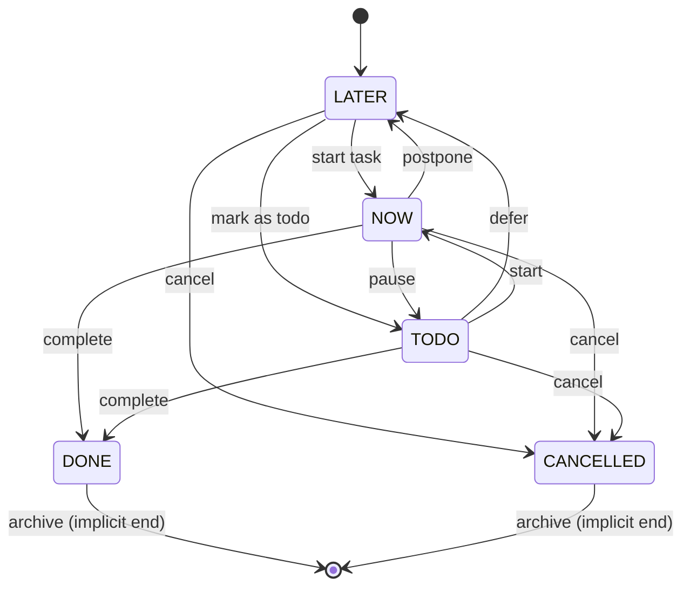

# State Machines - Logseq

> Máquinas de estado identificadas en el proyecto Quilt.
> Generado por: reversa-detective
> Fecha: 2026-05-02
Proyecto: Quilt
> Nivel: completo

---

## 1. Task State Machine

### 1.1 Task Status Lifecycle

```
                    ┌─────────────────────────────────────────┐
                    │                                         │
                    ▼                                         │
┌──────────┐    ┌─────────┐    ┌──────┐    ┌──────────┐    ┌────────────┐
│   NOW    │───►│  LATER  │───►│ TODO │───►│   DONE   │    │ CANCELLED  │
│(doing)   │◄───│         │◄───│      │    │          │    │            │
└──────────┘    └─────────┘    └──────┘    └──────────┘    └────────────┘
     │                 │            │           │                 │
     │                 │            │           │                 │
     │                 │            ▼           │                 │
     │                 │      (back to LATER)   │                 │
     │                 │                         │                 │
     └─────────────────┴─────────────────────────┴─────────────────┘
                              (Cualquier estado puede ir a CANCELLED)
```

**Estados**:

| Estado | Keyword | Descripción |
|--------|---------|-------------|
| `NOW` | `:logseq.property/status.doing` | Tarea en progreso |
| `LATER` | `:logseq.property/status.later` | Planificado para después |
| `TODO` | `:logseq.property/status.todo` | Por hacer |
| `DONE` | `:logseq.property/status.done` | Completado |
| `CANCELLED` | `:logseq.property/status.canceled` | Cancelado |

**Transiciones permitidas**:



**Reglas de negocio**:
- 🟢 **CONFIRMADO**: Los estados son valores cerrados (closed values) del schema
- 🟡 **INFERIDO**: No hay restricción explícita para transiciones arbitrarias en el código
- 🟡 **INFERIDO**: LATER, TODO son estados pendientes; DONE, CANCELLED son estados terminales

**Evidence** (del archivo `src/test/frontend/test/helper.cljs`):
```clojure
{"TODO" :logseq.property/status.todo
 "DOING" :logseq.property/status.doing
 "DONE" :logseq.property/status.done
 "CANCELED" :logseq.property/status.canceled
 "CANCELLED" :logseq.property/status.canceled}
```

---

## 2. Sync State Machine

### 2.1 Graph Sync Lifecycle

```
                           ┌──────────────────────────────────────┐
                           │                                      │
                           ▼                                      │
┌─────────┐    ┌─────────┴────────┐    ┌───────────┐    ┌────────┴────────┐
│ OFFLINE │───►│ CONNECTING       │───►│ SYNCING   │───►│ SYNCED          │
│         │◄───│                  │◄───│           │◄───│                 │
└─────────┘    └──────────────────┘    └───────────┘    └─────────────────┘
     │                  │                    │                    │
     │                  │                    │                    │
     │                  ▼                    ▼                    │
     │            ┌───────────┐          ┌───────────┐             │
     └───────────►│ ERROR     │◄─────────│ CONFLICT  │             │
                  │           │          │           │             │
                  └───────────┘          └───────────┘             │
                         │                   │                     │
                         │                   │                     │
                         └───────────────────┴─────────────────────┘
                                        (Pueden retry a CONNECTING)
```

**Estados**:

| Estado | Descripción |
|--------|-------------|
| `OFFLINE` | Sin conexión a internet |
| `CONNECTING` | Estableciendo conexión WebSocket |
| `SYNCING` | Sincronización en progreso |
| `SYNCED` | Sincronizado correctamente |
| `ERROR` | Error de sincronización |
| `CONFLICT` | Conflicto de datos |

**Evidence** (del git log y código):
```
fix(sync): reject stale numeric history ops
fix(sync): preserve apply-template block uuids on redo
fix(sync): remap apply-template internal value refs on redo
fix(sync): handle snapshot reset and tx epoch rollback
```

### 2.2 Sync Conflict Resolution

```
   ┌─────────────────────────────────────────────────────────────┐
   │                                                             │
   │   ┌─────────────┐         ┌─────────────┐                  │
   │   │   Remote    │         │    Local    │                  │
   │   │   TX        │         │    TX        │                  │
   │   └──────┬──────┘         └──────┬──────┘                  │
   │          │                       │                          │
   │          └───────────┬───────────┘                          │
   │                      │                                      │
   │                      ▼                                      │
   │              ┌───────────────┐                              │
   │              │   Compare     │                              │
   │              │  Checksums    │                              │
   │              └───────┬───────┘                              │
   │                      │                                      │
   │          ┌───────────┴───────────┐                         │
   │          │                       │                         │
   │          ▼                       ▼                         │
   │   ┌─────────────┐         ┌─────────────┐                  │
   │   │   Remote    │         │    Local    │                  │
   │   │   Wins      │         │    Wins     │                  │
   │   └─────────────┘         └─────────────┘                  │
   │                                                             │
   └─────────────────────────────────────────────────────────────┘
```

**Evidence** (de `frontend/worker/sync/apply_txs.cljs`):
```clojure
(defn- remote-sync-conflicts
  "Detecta conflictos entre transacciones remotas y locales"
  [rebase-db-before local-txs remote-txs]
  ;; ...
)
```

---

## 3. Publish State Machine

### 3.1 Page Publication States

```
┌─────────────────────────────────────────────────────────────────────┐
│                                                                      │
│   ┌──────────────┐    ┌──────────────┐    ┌───────────────────┐     │
│   │   PRIVATE    │───►│   PUBLIC     │───►│   PASSWORD        │     │
│   │              │◄───│              │    │   PROTECTED       │     │
│   └──────────────┘    └──────────────┘    └───────────────────┘     │
│                                                                      │
│   El flag :publishing/all-pages-public? afecta el comportamiento     │
│   por defecto para páginas sin setting explícito                      │
│                                                                      │
└─────────────────────────────────────────────────────────────────────┘
```

**Estados de publicación**:

| Estado | Property | Descripción |
|--------|----------|-------------|
| `PRIVATE` | `publishing-public? = false` | No visible públicamente |
| `PUBLIC` | `publishing-public? = true` | Visible en sitio publicado |
| `PASSWORD_PROTECTED` | con contraseña | Requiere contraseña |

**Reglas**:
- 🟢 **CONFIRMADO**: `all-pages-public? = true` hace todas las páginas públicas por defecto
- 🟢 **CONFIRMADO**: `publishing-public? = false` en página individual anula el default
- 🟡 **INFERIDO**: La contraseña de publicación es diferente de E2EE

**Evidence** (de `deps/publishing/src/logseq/publishing/db.cljs`):
```clojure
(defn filter-only-public-pages-and-blocks
  "Prepares a database assuming all pages are private unless
   a page has a publishing-public? property set to true"
  [db]
  ;; ...
)
```

---

## 4. Editor State Machine

### 4.1 Block Editing States

```
┌─────────────────────────────────────────────────────────────────────┐
│                                                                      │
│   ┌────────────┐    ┌────────────┐    ┌────────────────────────┐   │
│   │  VIEWING   │───►│  EDITING   │───►│  SAVING               │   │
│   │            │◄───│            │    │  (async)              │   │
│   └────────────┘    └────────────┘    └───────────┬────────────┘   │
│        ▲                                          │                 │
│        │                                          ▼                 │
│        │                               ┌────────────────────────┐   │
│        │                               │  SAVED                 │   │
│        │                               │  (return to VIEWING)  │   │
│        │                               └────────────────────────┘   │
│        │                                                          │
│        └──────────────────────────────────────────────────────────┘
│                        (on cancel or ESC)
│
│   VIEWING ──► SELECTED ──► (multiple selected for bulk ops)
│   VIEWING ──► COLLAPSED ──► (toggle collapse)
│
└─────────────────────────────────────────────────────────────────────┘
```

**Estados del editor**:

| Estado | Descripción |
|--------|-------------|
| `VIEWING` | Bloque visible, no seleccionado |
| `SELECTED` | Bloque seleccionado |
| `EDITING` | Bloque siendo editado |
| `SAVING` | Guardando cambios |
| `SAVED` | Cambios guardados |
| `COLLAPSED` | Bloque colapsado |

**Evidence** (de `frontend/state.cljs`):
```clojure
:editor/editing?                       (atom nil)
:editor/block                          (atom nil)
:editor/action                         (atom nil)
```

---

## 5. Journal Page State

### 5.1 Journal Page Creation

```
┌─────────────────────────────────────────────────────────────────────┐
│                                                                      │
│   ┌─────────────────┐    ┌─────────────────┐    ┌───────────────┐   │
│   │  DATE_DETECTED  │───►│  PAGE_CREATED  │───►│  JOURNAL_DAY  │   │
│   │  (from filename)│    │  (in database)  │    │  ASSIGNED     │   │
│   └─────────────────┘    └─────────────────┘    └───────────────┘   │
│                                                                      │
│   Journal day es un entero YYYYMMDD derivado del título             │
│                                                                      │
└─────────────────────────────────────────────────────────────────────┘
```

**Attributes**:

| Campo | Tipo | Descripción |
|-------|------|-------------|
| `:block/journal-day` | `Int` | Entero YYYYMMDD |
| `:logseq.class/Journal` | `Class` | Clase de journal |

**Evidence** (de `data-dictionary.md`):
```clojure
:block/journal-day    {:db/valueType :long
                       :db/index true}
```

---

## 6. Undo/Redo State Machine

### 6.1 Transaction History

```
┌─────────────────────────────────────────────────────────────────────┐
│                                                                      │
│   ┌───────────┐    ┌───────────┐    ┌───────────┐                  │
│   │  PAST     │◄───│  CURRENT  │───►│  FUTURE   │                  │
│   │  (undo    │    │  (head)   │    │  (redo    │                  │
│   │   stack)  │    │           │    │   stack)  │                  │
│   └───────────┘    └───────────┘    └───────────┘                  │
│        │                               │                            │
│        │     ┌─────────────────────────┘                            │
│        │     │                                                      │
│        ▼     ▼                                                      │
│   ┌─────────────────────────────────────────────────────────────┐  │
│   │  Protected transactions (journal edits) cannot be undone      │  │
│   └─────────────────────────────────────────────────────────────┘  │
│                                                                      │
└─────────────────────────────────────────────────────────────────────┘
```

**Evidence** (de `src/test/frontend/worker/pipeline_test.cljs`):
```clojure
(testing "Updating protected properties for built-in nodes"
  ;; :db/add should throw for journal protected attrs
  (is (= :journal-page-protected-attr-updated (:type (ex-data title-error))))
)
```

**Protected attributes for journals**:
```clojure
(def journal-protected-update-attrs
  #{:block/journal-day :block/name})
```

---

## 7. Plugin Lifecycle

### 7.1 Plugin States

```
┌─────────────────────────────────────────────────────────────────────┐
│                                                                      │
│   ┌───────────┐    ┌───────────┐    ┌───────────┐    ┌───────────┐  │
│   │  INSTALLED│───►│  LOADING  │───►│   ACTIVE  │───►│  DISABLED │  │
│   │           │    │           │    │           │    │           │  │
│   └───────────┘    └───────────┘    └───────────┘    └───────────┘  │
│        │                                                    ▲       │
│        │                    ┌──────────────────────────────┘       │
│        │                    │                                      │
│        └───────────────────►│                                      │
│             (uninstall)      │                                      │
│                               │                                      │
│                               ▼                                      │
│                        ┌───────────┐                                 │
│                        │  MARKET   │  (discover, install from market)│
│                        └───────────┘                                 │
│                                                                      │
└─────────────────────────────────────────────────────────────────────┘
```

**Evidence** (de `src/main/frontend/handler/plugin.cljs`):
```clojure
;; Plugin states managed via plugin/load! and plugin/unload!
;; Hooks: hook:db-tx, hook:block-changes, search:rebuildPagesIndice
```

---

## 8. Property Validation State

### 8.1 Property Schema States

```
┌─────────────────────────────────────────────────────────────────────┐
│                                                                      │
│   ┌─────────────┐    ┌─────────────┐    ┌─────────────────────┐    │
│   │  VALID     │───►│  INVALID    │───►│  SCHEMA_DEFINED     │    │
│   │  (passes   │    │  (fails     │    │  (matches built-in  │    │
│   │   rules)    │    │   validation)│    │   or custom schema) │    │
│   └─────────────┘    └─────────────┘    └─────────────────────┘    │
│                                                                      │
│   Invalid properties son almacenadas en :block/invalid-properties    │
│                                                                      │
└─────────────────────────────────────────────────────────────────────┘
```

**Evidence** (de `deps/db/src/logseq/db/frontend/property.cljs`):
```clojure
;; :public? - Boolean which allows property to be used by user
;; Valid values are :page, :block and :never
```

---

## 9. Escalas de Confianza

| Símbolo | Significado |
|----------|-------------|
| 🟢 **CONFIRMADO** | Extraído directamente del código o tests |
| 🟡 **INFERIDO** | Deducido de patrones y contexto |
| 🔴 **LACUNA** | No hay suficiente evidencia |

---

*Documento generado automáticamente por Reversa Detective*
