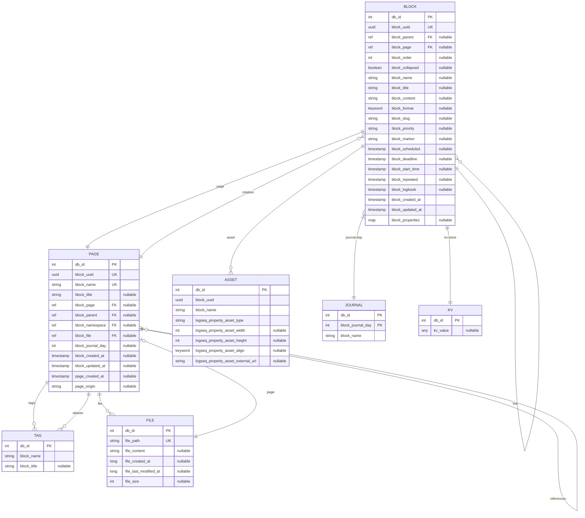

# ERD — Índice Visual

> **⚠️ NOTA**: Este documento es un **índice visual complementario**.
> Para el schema completo y canónico, ver **`docs/reversa/data-dictionary.md`**.
>
> Si hay divergencias entre este documento y `data-dictionary.md`,
> **data-dictionary.md es la fuente canónica**.
>
> **Fuente**: `deps/db/src/logseq/db/frontend/schema.cljs`
> **Fecha**: 2026-05-02

---

## Índice de Entidades

| Entidad | Descripción | Ver también |
|---------|-------------|--------------|
| [BLOCK](#1-block) | Unidad fundamental de contenido | `data-dictionary.md` §1.1 |
| [PAGE](#2-page) | Página (hereda de Block) | `data-dictionary.md` §1.2 |
| [FILE](#3-file) | Archivo en filesystem | `data-dictionary.md` §1.3 |
| [TAG](#4-tag) | Tags/clases asignados | `data-dictionary.md` §3.3 |
| [JOURNAL](#5-journal) | Página especial de journal | `data-dictionary.md` §1.2 |
| [ASSET](#6-asset) | Assets embebidos (imágenes, PDFs) | `data-dictionary.md` §6 |
| [KV](#7-kv) | Almacenamiento clave-valor | `data-dictionary.md` §1.4 |

---

## Diagrama ERD



---

## 1. BLOCK

> Ver: [`data-dictionary.md` §1.1](data-dictionary.md#11-block) para tabla completa de campos.

```
 Entidad: BLOCK
 PK:      db_id (int)
 UK:      block_uuid (UUID)
 índ:     block_parent, block_page, block_order, block_created_at, block_updated_at
```

**Campos principales**: `db/id`, `block/uuid`, `block/parent`, `block/page`, `block/order`,
`block/collapsed`, `block/name`, `block/title`, `block/content`, `block/format`,
`block/marker` (valores: `now`, `later`, `todo`, `done`, `cancelled`, `doing`, `waiting`),
`block/scheduled`, `block/deadline`, `block/created-at`, `block/updated-at`, `block/properties`.

---

## 2. PAGE

> Ver: [`data-dictionary.md` §1.2](data-dictionary.md#12-page) para tabla completa.

```
 Entidad: PAGE (hereda de BLOCK con block/name único)
 índ:     block_name, block_journal_day, block_namespace
```

**Diferencia clave**: PAGE es un BLOCK con `block/name` único y sin `block/parent` propio.

---

## 3. FILE

> Ver: [`data-dictionary.md` §1.3](data-dictionary.md#13-file) para tabla completa.

```
 Entidad: FILE
 PK:      db_id
 UK:      file_path (unique identity)
 índ:     file_path
```

---

## 4. TAG

> Ver: [`data-dictionary.md` §3.3](data-dictionary.md#33-tag-class) para detalles.

```
 Entidad: TAG (página con clase Tag)
 índ:     block_name, block_title
```

---

## 5. JOURNAL

> Ver: [`data-dictionary.md` §1.2](data-dictionary.md#12-page) — Journal es PAGE con `block/journal-day` no null.

```
 Entidad: JOURNAL (herencia de PAGE)
 PK:      block_journal_day
 índ:     block_journal_day, block_name
```

---

## 6. ASSET

> Ver: [`data-dictionary.md` §6](data-dictionary.md#6-entidades-de-plugins) para schema completo.

```
 Entidad: ASSET
 índ:     block_uuid
```

**Tipos**: image, pdf, audio, video.

---

## 7. KV

> Ver: [`data-dictionary.md` §1.4](data-dictionary.md#14-kv-key-value-store) para tabla completa.

```
 Entidad: KV
 PK:      db_id
 UK:      kv_key (unique identity)
```

---

## Relaciones Principales

| Relación | Tipo | Descripción |
|----------|------|-------------|
| BLOCK → PAGE | N:1 | Un bloque pertenece a una página |
| BLOCK → BLOCK (parent) | N:1 | Árbol de bloques |
| PAGE → PAGE (namespace) | N:1 (self-ref) | Namespaces jerárquicos |
| PAGE → TAG | N:M | Tags asignados |
| PAGE → FILE | N:1 | Página vinculada a archivo |
| BLOCK → BLOCK (refs) | N:M | Referencias bidireccionales |
| PAGE → JOURNAL | Herencia | `block/journal-day IS NOT NULL` |

---

## Restricciones de Negocio

| # | Regla | Fuente |
|---|-------|--------|
| 1 | UUID de bloque no puede cambiar una vez creado | `outliner/core.cljs:316-321` |
| 2 | Bloques built-in no pueden ser modificados | `outliner/core.cljs:464-468` |
| 3 | No mover bloque a sus propios descendientes | `outliner/core.cljs:962-968` |
| 4 | `db/ident` único globalmente | `schema.cljs:58` |

---

## Timestamps

| Tipo | Representación | Uso |
|------|---------------|-----|
| `long` | Unix epoch ms | Block created-at, updated-at, file timestamps |
| `int` (YYYYMMDD) | Día | block/journal-day |

---

## Índices Principales

| Entidad | Campo | Tipo |
|---------|-------|------|
| BLOCK | `db/id` | PK |
| BLOCK | `block/uuid` | Unique Identity |
| BLOCK | `block/page` | Index |
| BLOCK | `block/parent` | Index |
| BLOCK | `block/order` | Index |
| BLOCK | `block/journal-day` | Index |
| PAGE | `block/name` | Unique (para pages) |
| FILE | `file/path` | Unique Identity |

---

*Para el diccionario de datos completo y canónico, ver [`data-dictionary.md`](data-dictionary.md).*
*Generado por Reversa Architect - 2026-05-02*
