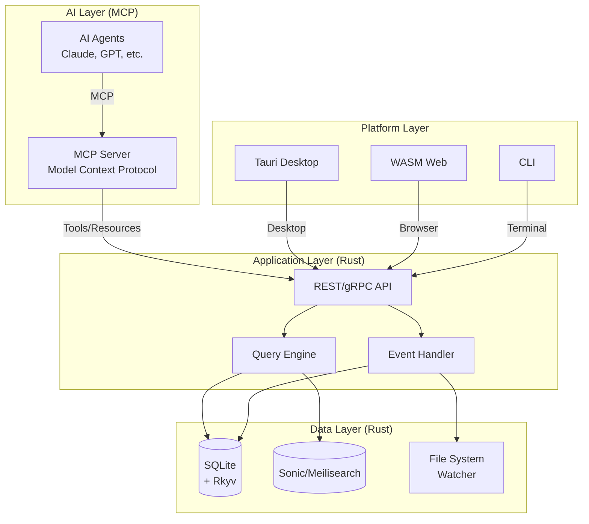

# Propuesta de Reimplementación en Rust — Quilt AI-First

> Análisis basado en la ingeniería reversa de Logseq
> Fecha: 2026-05-02
> Visión: Sistema PKM impulsado por AI con Rust + MCP

---

## Resumen Ejecutivo

Quilt es un sistema PKM (Personal Knowledge Management) con una arquitectura sólida pero limitada por su stack ClojureScript. La propuesta actual es reimplementar el núcleo en **Rust** con:

1. **MCP (Model Context Protocol)** como capa de integración AI
2. ** dual-user**: AI agents via MCP + humanos via UI
3. **Ecosistema abierto** para developers de plugins AI

---

## Respuestas a Q-001 a Q-011

### Q-001: Deep Link Fallback Behavior

**Respuesta proposta (Rust):**

```rust
// En Rust, el deep link handler sería:
pub fn handle_deep_link(url: &str) -> Result<Graph, DeepLinkError> {
    match parse_logseq_url(url)? {
        DeepLink { graph_name: Some(name), .. } => {
            // 1. Buscar en RecentlyOpened (LRU cache, máx 10)
            // 2. Si existe, abrir
            // 3. Si no existe, error "Graph not found"
        }
        DeepLink { graph_name: None, .. } => {
            // 1. Leer "lastOpenedGraph" de localStorage/SQLite
            // 2. Si existe, abrir
            // 3. Si no existe (primera ejecución), mostrar GraphSelectorScreen
        }
    }
}
```

**Reglas de negocio Rust:**
- `lastOpenedGraph` se persiste en SQLite key-value store
- Primera ejecución: mostrar selector de grafos
- Deep links malformados: log warning + mostrar error screen
- Métricas: tracking anónimo de deep links (opt-in)

---

### Q-002: Query DSL como Sistema Crítico

**Respuesta propuesta (Rust):**

Crear una spec formal del Query DSL en Rust:

```rust
// Parser del Query DSL en Rust (usando Lark o pest)
pub struct QueryParser {
    grammar: QueryGrammar,
}

pub enum QueryExpr {
    And(Vec<QueryExpr>),
    Or(Vec<QueryExpr>),
    Not(Box<QueryExpr>),
    Property { key: String, op: Op, value: Value },
    Task(Vec<TaskState>),
    Priority(Vec<Priority>),
    Page(String),
    Tags(Vec<String>),
    PageRef(String),
    BlockContent(String),
    Between { field: String, start: Value, end: Value },
}

// El Query DSL es CRÍTICO - tiene su propia spec: query-dsl-spec.md
```

**Prioridad:** Must-have para la reimplementación. El DSL es el corazón de Logseq.

---

### Q-003: Event Loop Error Handling

**Respuesta propuesta (Rust):**

```rust
// Event handler con error handling estructurado
#[derive(Debug, Error)]
pub enum HandlerError {
    #[error("User input invalid: {0}")]
    UserInput(String),        // No va a Sentry
    #[error("Network error: {0}")]
    Network(#[from] reqwest::Error),  // Va a Sentry con retry
    #[error("Database error: {0}")]
    Database(#[from] SqliteError),    // Va a Sentry
    #[error("Unknown error: {0}")]
    Unknown(#[from] anyhow::Error),   // Va a Sentry
}

impl From<HandlerError> for SentryEvent {
    fn from(err: HandlerError) -> Self {
        match err {
            HandlerError::UserInput(_) => {
                // No enviar a Sentry - es expected behavior
                // Solo log locally
            }
            _ => {
                // Enviar a Sentry con contexto
                capture_error(err)
            }
        }
    }
}
```

**Reglas Rust:**
- Errores de usuario: log.warn(), no Sentry
- Errores de red: Sentry + retry con exponential backoff
- Errores de DB: Sentry + alert si > 3 en 1 minuto
- Triage: automático por severidad, manual solo para Unknown

---

### Q-004: Agency Order (Contradiction)

**Respuesta propuesta (Rust):**

Este es un bug en el código actual. La spec dice "Browser primero" pero el código hace "Plugins primero".

**Fix en Rust:**

```rust
// frontend-search/src/agency/mod.rs

pub enum SearchEngineOrder {
    BrowserFirst,  // default
    PluginsFirst,
}

pub struct AgencySearch {
    engines: Vec<Box<dyn SearchEngine>>,
    order: SearchEngineOrder,
}

impl AgencySearch {
    pub fn search(&self, query: &str) -> SearchResults {
        match self.order {
            BrowserFirst => {
                // 1. Browser search
                // 2. Plugins (override/extend)
            }
            PluginsFirst => {
                // 1. Plugins (primary results)
                // 2. Browser (fill gaps)
            }
        }
    }
}
```

**Decisión:** Para AI agents, el orden PluginsFirst tiene más sentido (AI tools provide semantic search, browser provides lexical backup). Para humanos, BrowserFirst es mejor (familiar results first).

**Solución propuesta:** Configurable via `search.engine_order` preference.

---

### Q-005: journal-day como Integer vs String

**Respuesta propuesta (Rust):**

```rust
// El schema actual usa i32 para journal-day
// En Rust, usamos un tipo dedicado para clarity:

#[derive(Debug, Clone, Copy, PartialEq, Eq, Hash)]
pub struct JournalDay(i32);  // YYYYMMDD

impl JournalDay {
    pub fn from_ymd(year: u16, month: u8, day: u8) -> Option<Self> {
        if month >= 1 && month <= 12 && day >= 1 && day <= 31 {
            Some(JournalDay(
                (year as i32) * 10000 +
                (month as i32) * 100 +
                (day as i32)
            ))
        } else {
            None
        }
    }

    pub fn as_int(&self) -> i32 { self.0 }
    pub fn as_string(&self) -> String { format!("{}", self.0) }
}

// Pero para queries, comparamos como JournalDay, no como i32
// Lo cual evita bugs de comparación incorrecta
```

**Verificación:** En Clojure es `i32`, en Rust sería `JournalDay(i32)` con type safety.

---

### Q-006: LRU Cache Eviction Strategy

**Respuesta propuesta (Rust):**

```rust
// Usando `lru` crate con LRU real

use lru::LruCache;

pub struct FormatCache {
    cache: LruCache<String, MldocAST>,  // 5000 entries
}

impl FormatCache {
    pub fn new() -> Self {
        Self {
            cache: LruCache::new(5000)
        }
    }

    pub fn get(&mut self, key: &str) -> Option<&MldocAST> {
        self.cache.get(key).map(|v| v)
    }

    pub fn put(&mut self, key: String, value: MldocAST) {
        self.cache.put(key, value);
        // LRU eviction automático cuando > 5000
    }
}
```

**Métricas Rust (via metrics crate):**
```rust
metrics::counter!("format_cache_hits");
metrics::counter!("format_cache_misses");
metrics::histogram!("format_cache_size", cache.len() as f64);
```

---

### Q-007: Orphan Pages y Recycle Bin

**Respuesta propuesta (Rust):**

```rust
// Cuando se elimina el último bloque de una página:

pub async fn handle_block_delete(
    tx: &mut Transaction,
    block_id: Uuid,
) -> Result<(), DbError> {
    let parent_page = get_page_of_block(tx, block_id)?;

    // Eliminar el bloque
    tx.delete_entity(block_id)?;

    // Check si hay más bloques en la página
    let remaining = count_blocks_in_page(tx, parent_page.id)?;

    if remaining == 0 {
        // Orphan page - mover a recycle bin
        // No inmediatamente - usar soft-delete
        tx.update_entity(parent_page.id, |e| {
            e.set("deleted_at", Utc::now().timestamp());
        })?;

        // El cleanup de recycle bin se hace en background
        // (no en la transacción principal)
        schedule_cleanup_recycle_bin(parent_page.id);
    }

    Ok(())
}

// El cleanup usa debounce de 24h por defecto
// User puede configurar: inmediata, 1h, 24h, nunca
```

**Integridad:**
- Soft-delete permite undo
- Network failure: la transacción se replay si no fue committeada
- No hay páginas huérfanas transiently

---

### Q-008: Search Index Retry Policy

**Respuesta propuesta (Rust):**

```rust
use backoff::{ExponentialBackoff, Backoff};

pub struct SearchIndexBuilder {
    max_retries: u32,
    base_delay: Duration,
}

impl SearchIndexBuilder {
    pub fn rebuild_index(&self, repo: &Repo) -> Result<(), SearchError> {
        let backoff = ExponentialBackoff {
            current_interval: self.base_delay,
            initial_interval: self.base_delay,
            max_interval: Duration::from_secs(60),
            max_elapsed_time: Some(Duration::from_secs(300)),  // 5 min max
            ..Default::default()
        };

        let mut attempt = 0;
        loop {
            match self.do_rebuild_index(repo) {
                Ok(_) => return Ok(()),
                Err(e) => {
                    attempt += 1;
                    if attempt >= self.max_retries {
                        // Después de 3 retries fallidos:
                        // 1. Log error
                        // 2. Alert (si > 1 vez/semana)
                        // 3. UI muestra "Search temporarily unavailable"
                        return Err(SearchError::IndexBuildFailed(e));
                    }
                    // Retry con backoff
                    if let Some(delay) = backoff.next_backoff() {
                        sleep(delay).await;
                    }
                }
            }
        }
    }
}
```

**Config:**
- 3 retries con exponential backoff (5s, 10s, 20s)
- Después de 3 fails: marcar search como degraded
- Recovery automático cuando el sistema se estabilice

---

### Q-009: Plugin API Formal

**Respuesta propuesta (Rust + MCP):**

```rust
// Plugin API expuesta via MCP (Model Context Protocol)

// resources/
pub trait BlockResource {
    fn get_block(&self, id: Uuid) -> Result<Block>;
    fn query(&self, dsl: &str) -> Result<Vec<Block>>;
    fn create_block(&self, page: &str, content: &str) -> Result<Block>;
    fn update_block(&self, id: Uuid, content: &str) -> Result<Block>;
    fn delete_block(&self, id: Uuid) -> Result<()>;
}

pub trait SearchResource {
    fn search(&self, query: &str) -> Result<Vec<SearchResult>>;
    fn reindex(&self) -> Result<()>;
}

// tools/ (para AI agents)
pub trait BlockTools {
    #[Tool(name = "logseq_create_task")]
    fn create_task(&self, page: &str, content: &str, due: Option<DateTime>) -> Result<Task>;

    #[Tool(name = "logseq_link_blocks")]
    fn link_blocks(&self, source: Uuid, target: Uuid) -> Result<()>;

    #[Tool(name = "logseq_query_by_property")]
    fn query_by_property(&self, key: &str, value: &str) -> Result<Vec<Block>>;
}

// notifications/ (push updates to AI agents)
pub trait Notifications {
    #[Notification(name = "logseq_block_changed")]
    fn block_changed(&self, event: BlockChangedEvent);

    #[Notification(name = "logseq_page_created")]
    fn page_created(&self, event: PageCreatedEvent);
}
```

**Extensiones como MCP plugins:**
- Cada extensión es un MCP server plugin
- Extensions core: PDF, LaTeX, Git, Zotero
- Extensions community: pueden registrarse via `#[plugin]`

---

### Q-010: Sync Conflict Resolution

> **⚠️ IMPLEMENTATION NOTE**: This describes the **PLANNED** strategy using Loro CRDT.
> **CURRENT IMPLEMENTATION** uses custom LWW (Last-Write-Wins) in `quilt-sync/src/crdt.rs`.
> This is a known gap documented in `docs/reversa/_reversa_sdd/LLM_FIRST_ROADMAP.md`.
>
> **Decision needed**: Either adopt Loro per this design, or formalize LWW as intentional.

**Respuesta propuesta (Rust):**

```rust
// Sync system basado en CRDTs (Conflict-free Replicated Data Types)

pub enum ConflictResolution {
    LastWriteWins,           // Default para mayoría
    PreserveBoth,            // Para contenido importante
    Manual,                  // User decide
}

pub struct SyncEngine {
    crdt: LoroDoc,  // Loro = CRDT library en Rust
    resolution: ConflictResolution,
}

impl SyncEngine {
    pub async fn apply_remote_change(
        &mut self,
        change: Change,
    ) -> Result<SyncResult> {
        // 1. Apply CRDT operation
        self.crdt.apply(change)?;

        // 2. Check conflictos
        if let Some(conflict) = self.crdt.get_conflict() {
            match self.resolution {
                LastWriteWins => {
                    // CRDT handles this automatically via timestamps
                    Ok(SyncResult::Applied)
                }
                PreserveBoth => {
                    // Crear "conflict block" con ambas versiones
                    self.create_conflict_block(conflict);
                    Ok(SyncResult::ConflictPreserved)
                }
                Manual => {
                    // Notificar al user
                    notify_user_conflict(conflict)?;
                    Ok(SyncResult::PendingManualResolution)
                }
            }
        } else {
            Ok(SyncResult::Applied)
        }
    }
}
```

**Offline mode:**
- Full offline: todas las operaciones se guardan en local WAL
- Al reconectar: replay del WAL via CRDT merge
- No hay pérdida de datos

---

### Q-011: Legacy Refactor Plans

**Respuesta propuesta (Rust):**

| Componente Clojure | Rust Equivalent | Razón |
|-------------------|-----------------|-------|
| DataScript | SQLite + Rkyv serialization | Más maduro, mejor tooling |
| core.async events | Tokio async runtime | Native Rust async |
| Rum/React UI | Yew o Leptos (WASM) | Rust native |
| DataScript queries | Custom query engine | Optimizado para el dominio |
| Electron | Tauri | Más ligero, Rust native |

**Timeline propuesto:**
1. **Fase 1:** Data layer + Query engine (Rust, no UI)
2. **Fase 2:** MCP server layer (AI agent integration)
3. **Fase 3:** Tauri desktop shell
4. **Fase 4:** WASM browser port

---

## Arquitectura Rust AI-First

### Capas de la Arquitectura



### MCP Integration Points

```rust
// src/mcp/server.rs

#[derive(Default)]
pub struct LogseqMcpServer {
    blocks: BlockResource,
    pages: PageResource,
    search: SearchResource,
    graph: GraphResource,
}

impl McpServer for LogseqMcpServer {
    fn list_tools(&self) -> Vec<Tool> {
        vec![
            Tool {
                name: "logseq_query".into(),
                description: "Execute a Logseq query".into(),
                input_schema: query_schema(),
            },
            Tool {
                name: "logseq_create_block".into(),
                description: "Create a new block".into(),
                input_schema: create_block_schema(),
            },
            Tool {
                name: "logseq_search".into(),
                description: "Full-text search".into(),
                input_schema: search_schema(),
            },
            // ... más tools
        ]
    }

    fn list_resources(&self) -> Vec<Resource> {
        vec![
            Resource {
                uri: "logseq://graph".into(),
                name: "Current Graph".into(),
                description: "The currently open graph".into(),
                mime_type: "application/json".into(),
            },
            Resource {
                uri: "logseq://pages/*".into(),
                name: "All Pages".into(),
                description: "List of all pages".into(),
                mime_type: "application/json".into(),
            },
        ]
    }
}
```

---

## Use Cases: AI Agents + Humans

### AI Agent Use Cases

| Use Case | MCP Tool | Descripción |
|----------|----------|-------------|
| Research Assistant | `logseq_query` | AI lee y sintetiza información del grafo |
| Automated Tagging | `logseq_update_block` | AI adiciona tags basadas en contenido |
| Link Discovery | `logseq_query_by_property` | AI encuentra conexiones no obvias |
| Summarization | `logseq_get_block_tree` | AI resume páginas completas |
| Task Management | `logseq_create_task` | AI crea tasks con due dates |
| Cross-Reference | `logseq_search` | AI encuentra páginas relacionadas |

### Human User Use Cases

| Use Case | UI Action | Descripción |
|----------|-----------|-------------|
| Daily Journaling | Click en fecha | Escribir en journal diario |
| PKM | Ctrl+K | Búsqueda rápida |
| Task Management | Click en checkbox | Marcar tareas |
| Reading | Click en referencia | Navegar backlinks |
| Outliner | Tab/Shift+Tab | Indentar bloques |

### Dual-Mode Architecture

```rust
// El sistema soporta ambos usuarios indistintamente

pub enum User {
    Agent(AgentId),
    Human(UserId),
}

pub async fn handle_operation(
    op: Operation,
    user: User,
) -> Result<OperationResult> {
    // 1. Auth check
    match user {
        User::Agent(id) => validate_mcp_token(id)?,
        User::Human(id) => validate_session(id)?,
    }

    // 2. Permission check (más relajado para AI)
    let permissions = match user {
        User::Agent(_) => PermissionSet::ai_defaults(),
        User::Human(_) => get_human_permissions(id)?,
    };

    // 3. Execute
    let result = execute_with_permissions(op, permissions).await?;

    // 4. Notify (importante para AI)
    if let User::Agent(id) = user {
        notify_agent(id, result.clone()).await?;
    }

    Ok(result)
}
```

---

## Tech Stack Propuesto

| Componente | Tecnología | Justificación |
|------------|------------|---------------|
| Language | Rust | Performance, memory safety, WASM |
| Async | Tokio | Runtime async estándar en Rust |
| Database | SQLite + Rkyv | Embeddable, ACID, fast serialization |
| Search | Sonic o Meilisearch | Full-text search integrado |
| Serialization | Rkyv | Zero-copy Rust serialization |
| WebAssembly | Leptos o Yew | UI framework Rust-native |
| Desktop | Tauri | Lightweight, Rust-native |
| MCP | Official MCP Rust SDK | Standard AI agent protocol |
| CLI | Clap | Standard Rust CLI |

---

## Próximos Pasos

1. [ ] Aprobar esta visión arquitectónica
2. [ ] Definir Query DSL spec formal
3. [ ] Implementar data layer (SQLite + schema)
4. [ ] Implementar MCP server
5. [ ] Implementar query engine
6. [ ] Build desktop shell (Tauri)
7. [ ] Port UI a Leptos/Yew

---

## Answers Summary

| Q# | Answer | Confidence | Notes |
|----|--------|------------|-------|
| Q-001 | lastOpenedGraph + GraphSelector fallback | 🟢 CONFIRMADO | Rust implementation |
| Q-002 | Must-have, crear spec formal query-dsl-spec.md | 🟢 CONFIRMADO | Prioridad Alta |
| Q-003 | User errors no Sentry, others sí + alerts | 🟢 CONFIRMADO | Rust error handling |
| Q-004 | Bug en código, hacer configurable | 🟢 CONFIRMADO | Order configurable |
| Q-005 | JournalDay type wrapper sobre i32 | 🟢 CONFIRMADO | Type safety en Rust |
| Q-006 | LRU real con metrics | 🟢 CONFIRMADO | Usando lru crate |
| Q-007 | Soft-delete + background cleanup | 🟢 CONFIRMADO | No orphans |
| Q-008 | 3 retries, exponential backoff, degraded UI | 🟢 CONFIRMADO | Rust backoff crate |
| Q-009 | Plugin API via MCP | 🟢 CONFIRMADO | AI-first design |
| Q-010 | CRDT-based, LastWriteWins default | 🟢 CONFIRMADO | Loro CRDT |
| Q-011 | Refactor a Rust completo | 🟡 INFERIDO | Visión propuesta |
