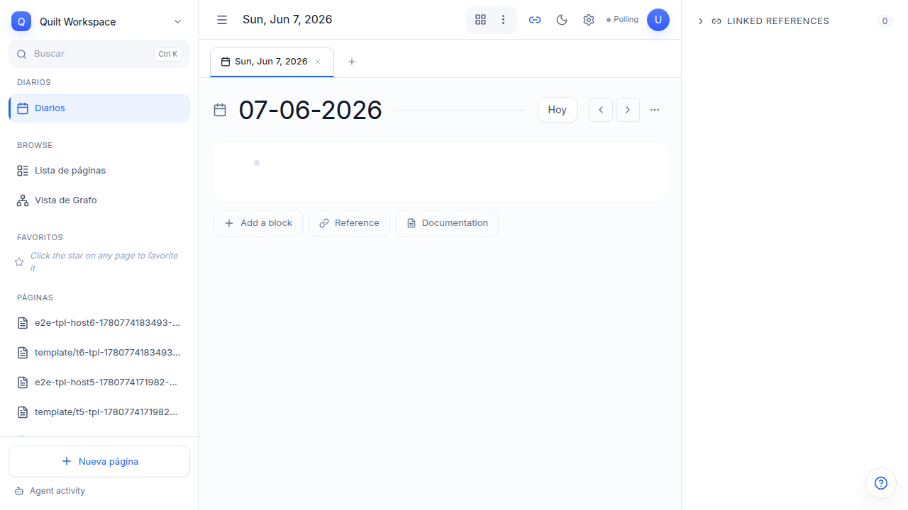
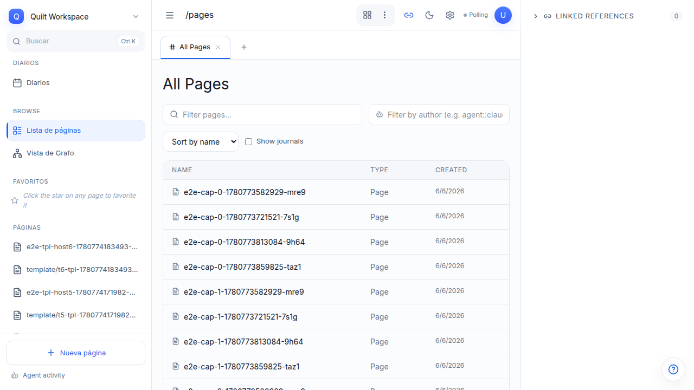
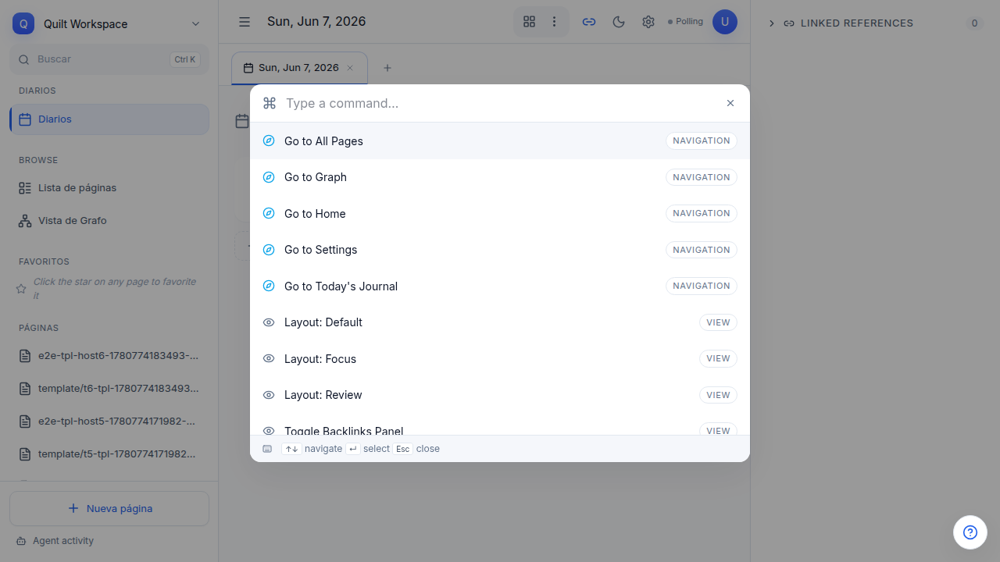
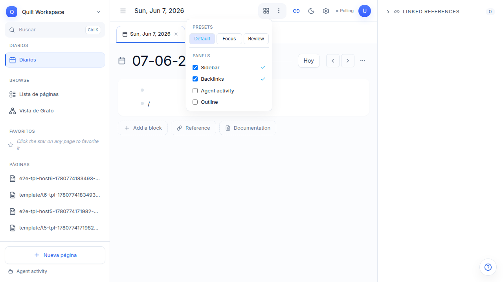
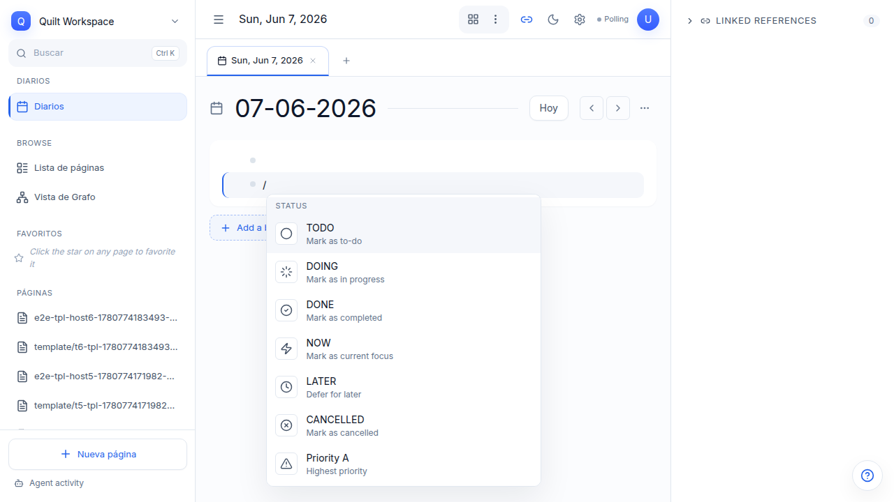
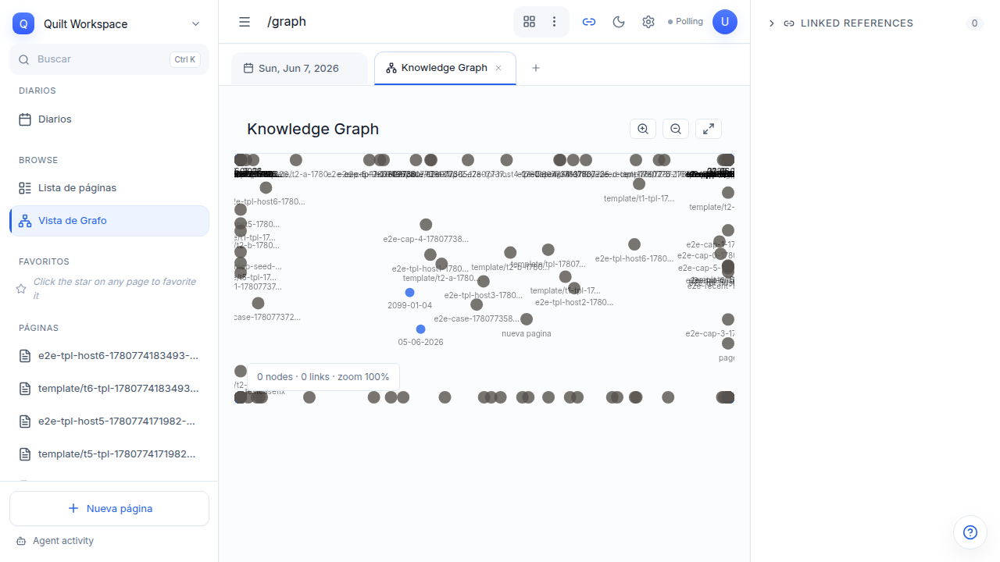
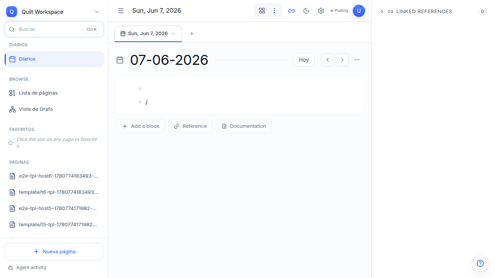
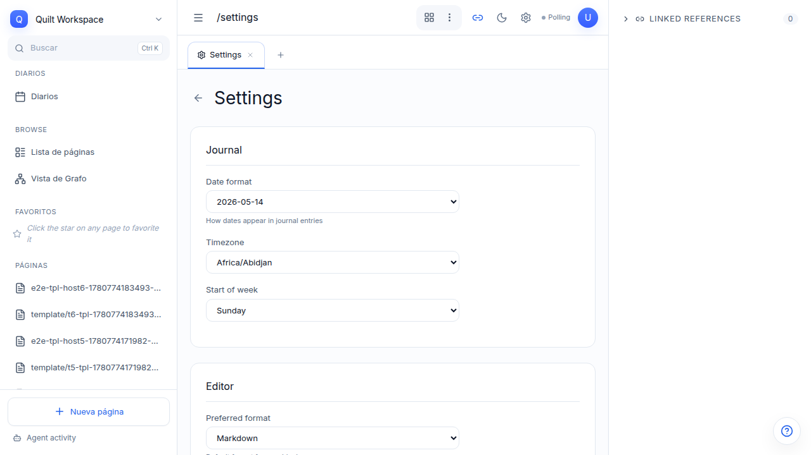

# User Manual — Quilt

> **Quilt** is your intelligent block-based workspace. Combines a structured outliner,
> a knowledge graph, and AI agents into a single local-first workspace.

---

## Getting Started

### 1. Start Quilt

```bash
just dev
```

This starts:
- **API Backend** at `http://localhost:3737`
- **React Frontend** at `http://localhost:5173`
- **WASM** for graph operations (if your platform supports it)

### 2. Configure the API Key

On first run, Quilt generates an API key and prints it to the server console:

```
✅ API key generated: 4eb04d25-ba93-44e3-baec-9c21ae5a9a2c
```

Copy that key and create it in `quilt-ui/.env`:

```env
VITE_QUILT_API_KEY=4eb04d25-ba93-44e3-baec-9c21ae5a9a2c
```

Open `http://localhost:5173` in your browser.

---

## Navigation

### Auto-redirect to Today's Journal

Opening `/` (root) automatically redirects you to today's journal:

```
/ → /journal/2026-06-07
```


### Journal View

Journals are automatically generated daily pages. Navigate with **Previous day**
and **Next day**, or click **Today** to jump back to the current day.



### Page List

All workspace pages. Create new ones from the journal or with **Cmd+Shift+K → New page**.



---

## Command Palette — `Cmd+Shift+K`

Quilt's command center. Press **`Cmd+Shift+K`** (Mac) or **`Ctrl+Shift+K`** (Linux/Windows)
from anywhere in the app to open the palette.



### What you can do from the palette

| Action | Description |
|--------|-------------|
| **New page** | Create a blank page |
| **Search** | Search across the entire workspace |
| **Toggle theme** | Switch between light and dark mode |
| **Layout: Default / Focus / Review** | Change panel preset |
| **Toggle Sidebar** | Show/hide the sidebar |
| **Toggle Backlinks** | Show/hide the references panel |

### Layout Panel (panel presets)

Access from the **Layout** button in the top bar or from `Cmd+Shift+K`:



| Preset | Visible panels |
|--------|----------------|
| **Default** | Sidebar + Journal + Backlinks |
| **Focus** | Journal only, no distractions |
| **Review** | Journal + expanded Backlinks |

You can also toggle panels individually (Sidebar, Backlinks, Agent Activity).

---

## Slash Commands — `/`

Slash commands transform blocks into different semantic types.
On any block, type `/` to open the command menu.



### Available commands

| Command | Action |
|---------|--------|
| `/h1`, `/h2`, `/h3` | Convert to heading (sets `level:: 1/2/3`) |
| `/code` | Code block |
| `/quote` | Quote |
| `/task` | **Task role** — sets `type:: task` + `status:: todo` |
| `/query` | **Query role** — sets `type:: query` + `dsl::` (prompts for DSL) |
| `/card` | **Card shape** — sets `card-shape::` (prompts for shape) |
| `/divider` | Visual separator |
| `/bullet`, `/numbered` | Bullet or numbered list |

### Block roles

Quilt uses **properties** to define semantic roles (not just visual).
A block with `type:: task` is a task; with `type:: query` is a query;
with `type:: agent-run` is an agent execution block.

#### `/task` — Task role

Sets `type:: task` and `status:: todo`. You can then change the status
to `done`, `cancelled`, etc.

#### `/query` — Query role

Sets `type:: query` and prompts for a DSL (Domain Specific Language) to define
the query. The query can be executed by Quilt's search engine.

#### `/card` — Card shape

Sets `card-shape::` with values: `content`, `reference`, `presentation`,
`article`, `note`.

---

## Knowledge Graph

Visualizes connections between your blocks. The graph is interactive:
click on a node opens the page, scroll to zoom, drag to move.

> **Dark mode**: the graph detects `data-theme="dark"` and renders
> with a dark background automatically.



---

## Search

Search across the entire workspace from the sidebar input or with `Cmd+Shift+K → Search`.

Includes page autocomplete, full-text search results, and property filters.



---

## Saved Views (`type:: view`)

A **saved view** is a block that references an existing query and defines
how to render it. Model:

```
Query block:
  type:: query
  dsl:: (and (task todo) (project "my-project"))

View block:
  type:: view
  view-type:: kanban
  data-source:: <uuid-of-query-block>
  view-name:: My Tasks
  group-by:: priority
```

Multiple views can share the same query with different renderers:
`kanban`, `table`, `list`, `graph`, `cards`, `calendar`, `timeline`.

---

## Agent Blocks (`type:: agent-run`)

When an external agent executes operations in Quilt, each execution is recorded
as a block with `type:: agent-run`. The block shows:

- Agent name (`agent::`)
- Model used (`model::`)
- Execution status: `Queued` → `Running` → `Completed` / `Failed` / `Cancelled`
- Start timestamp (`started-at::`)

Status colors:

| Status | Color |
|--------|-------|
| Queued / Cancelled | Grey |
| Running | Blue |
| Completed | Green |
| Failed | Red |

---

## Natural Language Dates

In property values you can write dates as plain text:

| Written | Resolves to |
|---------|-------------|
| `today` | The current date |
| `tomorrow` | Tomorrow's date |
| `yesterday` | Yesterday's date |

Example: a property `due:: today` on a task automatically resolves to the current day.

---

## Block Zoom — `?zoom=$blockId`

Zoom to any block making its content the focus of the view.
Use the URL with the `?zoom=` parameter to deep-link to a specific block:

```
/journal/2026-06-07?zoom=abc123
```

This opens the journal centered on block `abc123`, with its content expanded
and the rest of the page dimmed.

---

## Settings

Access from the top menu → **Settings**.



Here you can:
- Change the theme (light/dark)
- Configure the polling interval for synchronization
- Manage the API key

---

## Keyboard Shortcuts

| Shortcut | Action |
|----------|--------|
| `Cmd+Shift+K` / `Ctrl+Shift+K` | Open command palette |
| `Cmd+Z` / `Ctrl+Z` | Undo last action |
| `Enter` on a block | Create sibling block |
| `Tab` | Indent block (make child) |
| `Shift+Tab` | Un-indent block (make parent) |
| `/` at start of block | Open slash command menu |
| `Esc` | Close menus/modals |

---

## Property Architecture

In Quilt everything is a **block** with **typed properties**. No frontmatter fields
like in other systems — properties are stored in a `properties` column (JSONB in SQLite).

### Reserved properties

| Property | Type | Use |
|----------|------|-----|
| `type::` | role | Block role: `task`, `query`, `view`, `agent-run`, `comment`... |
| `status::` | select | Status: `todo`, `done`, `running`, `cancelled`... |
| `priority::` | select | Priority: `A`, `B`, `C` |
| `due::` | date | Due date (supports NL: today/tomorrow/yesterday) |
| `dsl::` | string | Query DSL (for `type:: query` blocks) |
| `data-source::` | block-ref | Source block UUID (for views) |
| `view-type::` | select | Renderer type: `kanban`, `table`, `list`... |
| `agent::` | string | Agent name |
| `model::` | string | Model used by the agent |
| `run-status::` | select | Agent execution status |
| `card-shape::` | select | Visual card shape |
| `level::` | number | Heading level (1-3) |

---

*Auto-generated — `just dev` + Playwright CLI*
